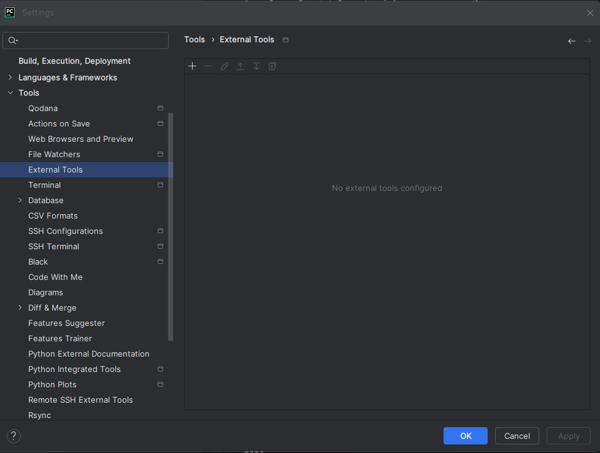
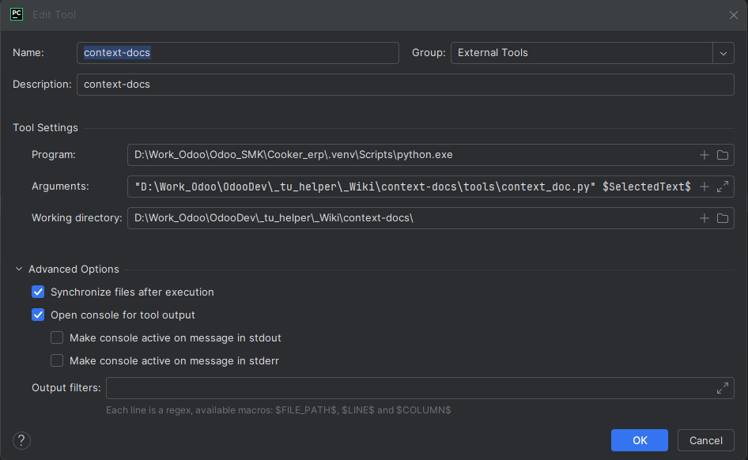

 1. Скачать и распаковать проект
Скачай архив:
📦 context-docs.zip

Распакуй его в любое удобное место (например, рядом с проектом в PyCharm).

📌 2. Настроить документацию
В папке docs/ у тебя уже есть html.md с примерами.
Если хочешь добавить новые термины:

Создай новый .md файл в docs/ (например, css.md)

Заполняй в формате:

    ## h1
    Тег <h1> — главный заголовок страницы.
    
    ## p
    Тег 
 — абзац текста.
    Скрипт сам найдёт описание во всех .md в папке.

📌 3. Подключить в PyCharm
===============================================================
Открой PyCharm.

File → Settings → Tools → External Tools → +

Заполни:
--------------------
Name: Open Doc

Program: путь к Python (например, python или полный путь C:\Python311\python.exe)

Python 3.10 (Odoo_17) D:\Odoo_17\venv\Scripts\python.exe

Arguments:
--------------------
"ПУТЬ_К_ПРОЕКТУ/tools/open_doc.py" $SelectedText$
(замени ПУТЬ_К_ПРОЕКТУ на путь к папке context-docs)

"D:\Work_Odoo\OdooDev\_tu_helper\_Wiki\context-docs\tools\context_doc.py" $SelectedText$
"D:\Odoo\OdooDev\_tu_helper\_Wiki\context-docs\tools\context_doc.py" $SelectedText$

Working directory:
--------------------
ПУТЬ_К_ПРОЕКТУ

📌 4. Назначить горячую клавишу
===============================================================
File → Settings → Keymap

Найди External Tools → Open Doc

Кликни правой кнопкой → Add Keyboard Shortcut

Введи, например: Ctrl+Shift+D

📌 5. Как пользоваться
В коде выдели слово (например, html, div, img).

Нажми Ctrl+Shift+D.

Появится окно с описанием из твоей документации.
Если точного совпадения нет — предложит похожее.

💡 Плюсы этого подхода
📂 Документация хранится в проекте (можно в Git).

📄 Сколько угодно .md файлов (по темам).

🔍 Быстрый поиск по выделенному слову.

🌐 Позже можно эти же файлы опубликовать на сайте через MkDocs.

tools/
  app_main.py         # центральная точка входа
  config_roots.py     # чтение doc_roots.txt и настройка корней документации
  utils.py            # утилиты: нормализация, токенизация, проверка разделителей
  models.py           # модели данных (Section)
  md_parser.py        # парсер Markdown и сбор секций из корней
  search_index.py     # индекс и логика подсказок/поиска
  ui_tree.py          # помощник: вставка секции в дерево категорий
  ui_app.py           # всё Tkinter-GUI (одно дерево категорий, markdown+путь, кодовые блоки)
  doc_roots.txt       # (рядом) список корней с документациями, по одному пути на строку
