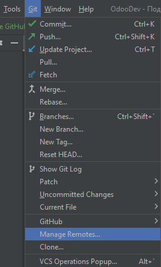
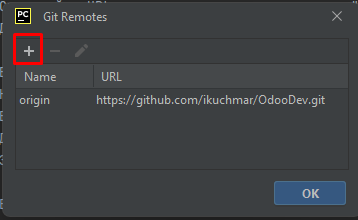

Для подключения репозитория GitHub к вашему проекту в PyCharm следуйте этим шагам:

Откройте или Создайте проект:

Если у вас уже есть открытый проект в PyCharm, можете использовать его. В противном случае создайте новый проект,
выбрав "Файл" -> "Новый проект".
Инициализируйте Git-репозиторий (если это ещё не сделано):

Если ваш проект ещё не является Git-репозиторием, вы можете инициализировать его. В главном меню выберите "VCS" -> "
Включить интеграцию с системой контроля версий". Затем выберите "Git" как систему контроля версий.
Добавьте ваш репозиторий GitHub:

Перейдите в свой аккаунт GitHub и найдите репозиторий, который вы хотите подключить.
Скопируйте URL репозитория с помощью кнопки "Code" на GitHub (URL должен иметь
вид: https://github.com/имя-пользователя/имя-репозитория.git).
Добавьте URL репозитория GitHub в ваш проект:

В PyCharm перейдите в "VCS" -> "Git" -> "Удаленные" (Remotes).

Нажмите на кнопку "+" для добавления нового удаленного репозитория.
Вставьте URL репозитория GitHub, который вы скопировали на предыдущем шаге.
Дайте удаленному репозиторию имя (обычно "origin" - это стандартное имя).

Загрузите код из репозитория GitHub (по желанию):

Если вы хотите склонировать код из репозитория GitHub в ваш проект на локальном компьютере, выберите "VCS" -> "Git" -> "
Pull" и выберите репозиторий GitHub, который вы добавили на предыдущем шаге. Это загрузит код с GitHub на ваш компьютер.
Загрузите изменения в репозиторий GitHub (по желанию):

Если вы хотите отправить ваши локальные изменения в репозиторий GitHub, внесите изменения в проекте, затем выберите "
VCS" -> "Git" -> "Зафиксировать" (Commit), чтобы зафиксировать изменения локально. Затем выберите "VCS" -> "Git" -> "
Отправить" (Push), чтобы отправить изменения в репозиторий GitHub.
Теперь ваш проект в PyCharm должен быть подключен к репозиторию GitHub, и вы сможете легко выполнять операции с кодом,
используя систему контроля версий Git, интегрированную в PyCharm.

Обратите внимание, что для успешной работы с Git вам нужно установить Git на вашем компьютере и настроить его с учетными
данными GitHub. Если вы ещё не сделали этого, вы можете загрузить Git с официального сайта (https://git-scm.com/) и
выполнить настройку, следуя инструкциям.