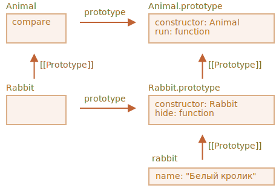

# Статические свойства и методы

Мы также можем присвоить метод самому классу. Такие методы называются *статическими*.

В объявление класса они добавляются с помощью ключевого слова `static`, например:

```js run
class User {
*!*
  static staticMethod() {
*/!*
    alert(this === User);
  }
}

User.staticMethod(); // true
```

Это фактически то же самое, что присвоить метод напрямую как свойство функции:

```js
class User { }

User.staticMethod = function() {
  alert(this === User);
};
```

Значением `this` при вызове `User.staticMethod()` является сам конструктор класса `User` (правило "объект до точки").

Обычно статические методы используются для реализации функций, принадлежащих классу целиком, вообще, и при этом не относящимся к каким-то отдельным объектам.

Звучит не очень понятно? Сейчас все встанет на свои места.

Например, есть объекты статей `Article`, и нужна функция для их сравнения.

Естественное решение – сделать для этого статический метод `Article.compare`:

```js run
class Article {
  constructor(title, date) {
    this.title = title;
    this.date = date;
  }

*!*
  static compare(articleA, articleB) {
    return articleA.date - articleB.date;
  }
*/!*
}

// использование
let articles = [
  new Article("HTML", new Date(2019, 1, 1)),
  new Article("CSS", new Date(2019, 0, 1)),
  new Article("JavaScript", new Date(2019, 11, 1))
];

*!*
articles.sort(Article.compare);
*/!*

alert( articles[0].title ); // CSS
```

Здесь метод `Article.compare` стоит "над" статьями, как средство для их сравнения. Это метод не отдельной статьи, а всего класса.

Другим примером может быть так называемый "фабричный" метод.

Скажем, нам нужно несколько способов создания статьи:

1. Создание через заданные параметры (`title`, `date` и т. д.).
2. Создание пустой статьи с сегодняшней датой.
3. ...или как-то ещё.

Первый способ может быть реализован через конструктор. А для второго можно использовать статический метод класса.

Такой как `Article.createTodays()` в следующем примере:

```js run
class Article {
  constructor(title, date) {
    this.title = title;
    this.date = date;
  }

*!*
  static createTodays() {
    // помним, что this = Article
    return new this("Сегодняшний дайджест", new Date());
  }
*/!*
}

let article = Article.createTodays();

alert( article.title ); // Сегодняшний дайджест
```

Теперь каждый раз, когда нам нужно создать сегодняшний дайджест, нужно вызывать `Article.createTodays()`. Ещё раз, это не метод одной статьи, а метод всего класса.

Статические методы также используются в классах, относящихся к базам данных, для поиска/сохранения/удаления вхождений в базу данных, например:

```js
// предположим, что Article - это специальный класс для управления статьями
// статический метод для удаления статьи по id:
Article.remove({id: 12345});
```

````warn header="Статические методы недоступны для отдельных объектов"
Статические методы могут вызываться для классов, но не для отдельных объектов.

Например. такой код не будет работать:

```js
// ...
article.createTodays(); /// Error: article.createTodays is not a function
```
````

## Статические свойства

[recent browser=Chrome]

Статические свойства также возможны, они выглядят как свойства класса, но с `static` в начале:

```js run
class Article {
  static publisher = "Илья Кантор";
}

alert( Article.publisher ); // Илья Кантор
```

Это то же самое, что и прямое присваивание `Article`:

```js
Article.publisher = "Илья Кантор";
```

## Наследование статических свойств и методов [#statics-and-inheritance]

Статические свойства и методы наследуются.

Например, метод `Animal.compare` в коде ниже наследуется и доступен как `Rabbit.compare`:

```js run
class Animal {

  constructor(name, speed) {
    this.speed = speed;
    this.name = name;
  }

  run(speed = 0) {
    this.speed += speed;
    alert(`${this.name} бежит со скоростью ${this.speed}.`);
  }

*!*
  static compare(animalA, animalB) {
    return animalA.speed - animalB.speed;
  }
*/!*

}

// Наследует от Animal
class Rabbit extends Animal {
  hide() {
    alert(`${this.name} прячется!`);
  }
}

let rabbits = [
  new Rabbit("Белый кролик", 10),
  new Rabbit("Чёрный кролик", 5)
];

*!*
rabbits.sort(Rabbit.compare);
*/!*

rabbits[0].run(); // Чёрный кролик бежит со скоростью 5.
```

Мы можем вызвать `Rabbit.compare`, при этом будет вызван унаследованный `Animal.compare`.

Как это работает? Снова с использованием прототипов. Как вы уже могли предположить, `extends` даёт `Rabbit` ссылку `[[Prototype]]` на `Animal`.



Так что `Rabbit extends Animal` создаёт две ссылки на прототип:

1. Функция `Rabbit` прототипно наследует от функции `Animal`.
2. `Rabbit.prototype` прототипно наследует от `Animal.prototype`.

В результате наследование работает как для обычных, так и для статических методов.

Давайте это проверим кодом:

```js run
class Animal {}
class Rabbit extends Animal {}

// для статики
alert(Rabbit.__proto__ === Animal); // true

// для обычных методов
alert(Rabbit.prototype.__proto__ === Animal.prototype); // true
```

## Итого

Статические методы используются для функциональности, принадлежат классу "в целом", а не относятся к конкретному объекту класса.

Например, метод для сравнения двух статей `Article.compare(article1, article2)` или фабричный метод `Article.createTodays()`.

В объявлении класса они помечаются ключевым словом `static`.

Статические свойства используются в тех случаях, когда мы хотели бы сохранить данные на уровне класса, а не какого-то одного объекта.

Синтаксис:

```js
class MyClass {
  static property = ...;

  static method() {
    ...
  }
}
```

Технически, статическое объявление - это то же самое, что и присвоение классу:

```js
MyClass.property = ...
MyClass.method = ...
```

Статические свойства и методы наследуются.

Для `class B extends A` прототип класса `B` указывает на `A`: `B.[[Prototype]] = A`. Таким образом, если поле не найдено в `B`, поиск продолжается в `A`.
