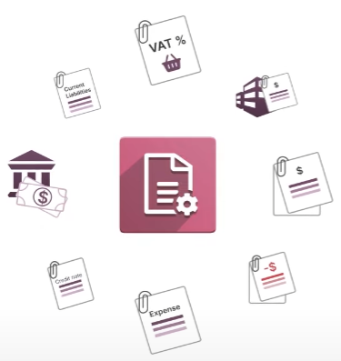
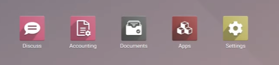
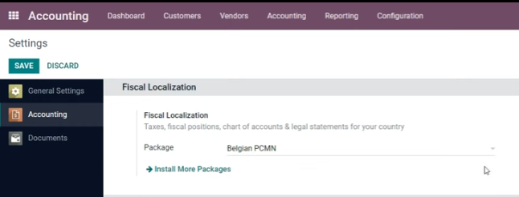
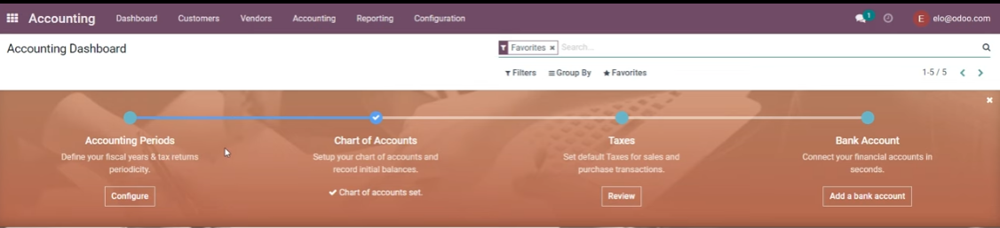
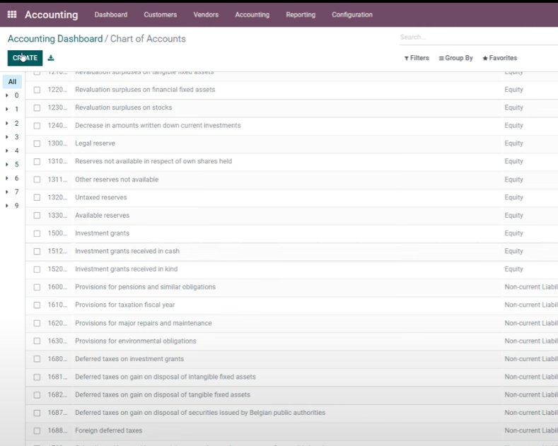
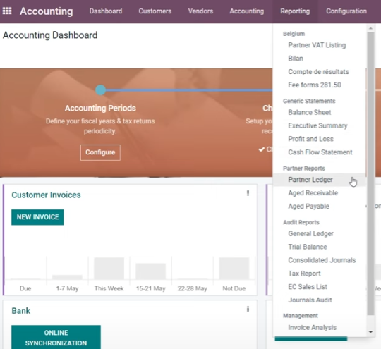

Добро пожаловать, браво, делатели, пристегнитесь для этого кругосветного путешествия, пока мы вместе изучаем
бухгалтерский учет. Я Ева. Я бизнес-аналитик здесь, в todo, а также эксперт по бухгалтерскому учету в нашей компании.
Оплата автомобилей Большое количество сотрудников тратит время на обработку и подсчет операций, спасибо для этого у нас
есть возможность хранить все бухгалтерские операции и документы в одном месте, что позволяет нам сэкономить много
времени и избежать ошибок с другим бухгалтерским учетом, мы можем быть намного эффективнее благодаря всем функциям,
доступным в программном обеспечении, 

кроме того, есть много интеграций с другими приложениями, такими как продажи или
инвентаризация, что еще проще для нас, чтобы получить правильную информацию от других отделов, этот курс будет
охватывать основные понятия и конфигурации, которые помогут вам настроить свой учет, чтобы вы видели здесь обзор из
основных тем мы увидим вместе в различных видеороликах, какая захватывающая программа, мы часто прикрепляли полезные
вспомогательные материалы к видео, и вы можете получить к ним доступ по ссылкам ниже тех, что в списке, в документации
вы найдете дополнительный теоретический контент, а некоторые часто вместе со мной задавали вопросы по нашим темам
бухгалтерского учета, вы увидите, как некоторые из моих коллег следят за учебными пособиями, привет, Ева, я рада
присоединиться к этому курсу, так каковы наиболее важные конфигурации для начала моего бухгалтерского учета в udo, я
очень рад, что вы спросили этот вопрос, киара, минимальный минимум, 

чтобы убедиться, что ваше бухгалтерское приложение
готово к работе, основан на трех столпах: 
 - план счетов, 
 - журналы 
 - и налоги, 

 - если вы правильно настроили эти три вещи, вы
готовы пойти на свои первые счета-фактуры, обратите внимание несмотря на то, что у нас могут быть дополнительные
настройки, основанные на других приложениях, которые могут быть в вашей базе данных, давайте посмотрим, как выглядит
учет в нашей базе данных pincas, хорошо, ребята, итак, мы в базе данных аудио, 
- 
давайте зайдем в бухгалтерское
приложение, чтобы увидеть как это устроено, так что здесь вы сначала попадаете на панель учета,

и у вас уже есть некоторая информация, доступная для вас, поэтому мы находимся в представлении канбана, поэтому каждое поле здесь
представляет журнал в вашем учете, и, прежде всего, у нас также есть мастер адаптации в пределах, доступный для помочь
вам настроить ваше бухгалтерское приложение, 

так как же у вас уже есть некоторые журналы и некоторая информация в вашем
бухгалтерском приложении без правильной настройки какой-либо конфигурации, потому что, когда вы создаете свою базу
данных и выбираете свою страну, урду установит локализацию бухгалтерского учета пакет, относящийся к этой стране, чтобы
получить к нему доступ, вам нужно зайти в меню конфигурации и в настройках узнать, какой пакет локализации был загружен,
поэтому здесь первая настройка предназначена для фискальной локализации, и, как вы можете видеть здесь, мой пакет -
бельгийский, поскольку я работаю в бельгийской компании, 

вы можете решить установить больше пакетов, если хотите,
например, если вы находитесь в среде с несколькими компаниями и у вас есть компании из разных стран, вам, конечно, может
потребоваться загрузить новый пакет, обратите внимание, что эта функция исчезнет, если у вас есть какая-либо запись
журнала, созданная в системе, даже в черновике, она исчезнет, поэтому убедитесь, что у вас есть правильная локализация,
прежде чем вы начнете вести учет. 

Теперь давайте вернемся к панели инструментов, чтобы увидеть, как она построена, как
я. говоря, что у нас также есть здесь наши разные журналы, и вы можете очень легко увидеть различные типы, поэтому у нас
есть доступ к счетам наших клиентов, счетам наших поставщиков и нашим банковским выпискам, так что все в одном месте с
помощью мастера адаптации, вы должны настроить все это, прежде чем быть готовы к работе, так что сначала или мы хотим,
чтобы вы настроили свой отчетный период, поэтому убедитесь, что звук должен знать последний день вашего финансового
года, 

у вас также есть возможность обновить свой план счетов, поэтому отсюда у вас есть доступ к плану счетов из
локализации, которая была загружена, и вы можете очень легко изменить, поскольку вы можете видеть, например, финансовый
год, вы можете изменить все, что хотите, изменить имена, изменить код, как это, очень легко и сохранить все, что вы
хотите, 

и если вы зайдите на панель инструментов, конечно, здесь это будет подтверждено, также есть налоги и банковский
счет, которые вы можете синхронизировать, все эти шаги были объяснены в других видео в электронном обучении, поэтому не
стесняйтесь проверить их, чтобы сделать убедитесь, что вы не пропустите ни одной конфигурации. 

Еще одна вещь, которую
загрузит локализация, - это также юридическая отчетность из вашей страны, поэтому здесь, например, здесь, в Бельгии, у
нас есть специальные отчеты, но для стран, для которых у нас недостаточно информации в юридическом репозитории у нас
также есть общие отчеты для балансового отчета о прибылях и убытках и так далее, поэтому, даже если пакет локализации не
завершен, у вас будут юридические отчеты, доступные для вас в системе, это все для меня в этом видео, спасибо за
просмотр chatutti 

