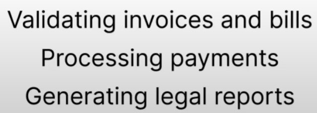
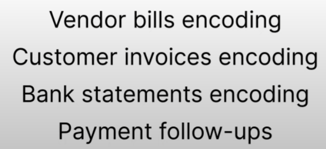
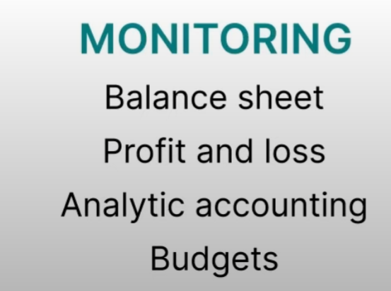
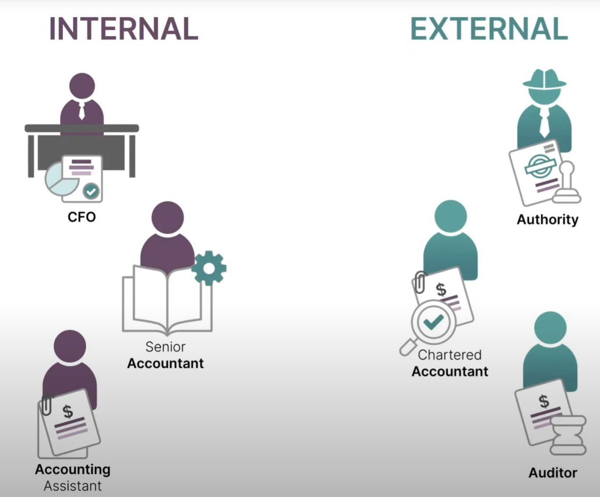
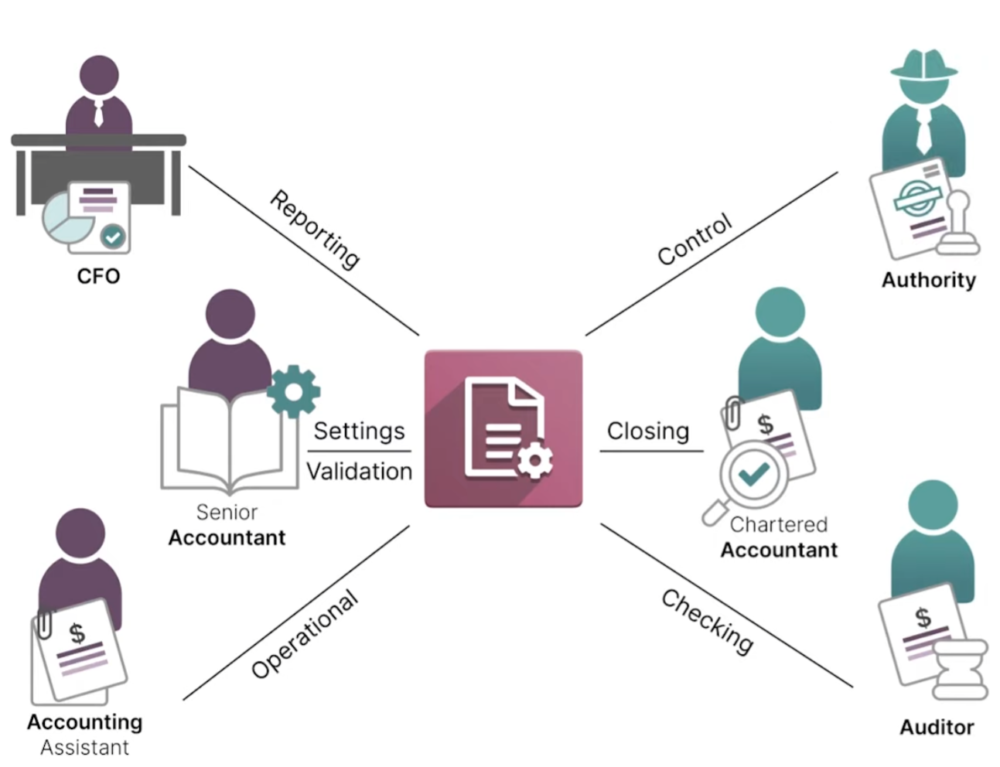
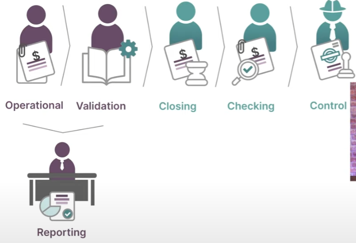

Роли бухгалтерского учета в компании

# Старший бухгалтер (senior accountant)

в обязанности которого входит:
 - настройка основных параметров бухгалтерского приложения, таких как:
   - план счетов, 
   - журналы и налоги, 

 как только это будет сделано и бухгалтерский учет ведется, они несут ответственность за:
   - проверку счетов и счетов, 
   - обрабатывают платежи 
   - и составляют юридические отчеты,

# Бухгалтер помощник (accounting assistance)

в обязанности которой входит повседневная бухгалтерия компании, что
означает, что :
 - кодирование счета поставщика
 - кодирование счета-фактуры клиентов, 
 - обработка банковских выписок 
 - и управление последующими платежами,

эти действия должны быть выполнены быстро, поскольку старший бухгалтер должен проверить все эти действия после этого. 

# Финансовый директор (cfo) (the chief financial officer), 

Обязанности, которого заключается в мониторинге финансового состояния компании,
и вы знаете, есть ли у них разные инструменты, чтобы убедиться, что это работает, например, 
в юридической отчетности,
такой как 
- баланс 
- и отчет о прибылях и убытках, 
- а также в некоторых инструментах управления, таких как аналитический учет
- и управление бюджетом 

- 
на основе всю эту информацию они смогут принимать быстрые и эффективные решения для финансового
благополучия компании, 

давайте теперь перейдем к внешним заинтересованным сторонам, таким как 

# дипломированный бухгалтер (chartered accountant)

в обязанности которого входит 

- закрытие налогового периода и финансового года компании 
 
и сделать это, им нужно просмотреть статьи журнала, которые относятся к этому периоду, и они могут проверить, что через балансовый отчет к
отчету о прибылях и убытках им придется внести некоторые коррективы, если необходимо, в эти записи, и, наконец, они
будут иметь 

Следующим шагом для регистрации заключительной записи в журнале является 

аудитор аудитор гарантирует, что

финансовая отчетность является правдивой и справедливой, чтобы убедиться, что внешние заинтересованные стороны принимают
рациональные, актуальные и разумные решения, 

и, наконец, у нас может быть некоторое взаимодействие с властями, 

которые могут вмешаться, чтобы избежать мошенничество в вашем бухгалтерском учете, например, из-за неучтенных несоответствий в
отчете о подоходном налоге и уплаченных налогах и т. д.,

есть много разных заинтересованных сторон, 

но все они работают вместе с одним приложением бухгалтерского учета

на внутренней стороне мы у нас будет старший бухгалтер, который настроит приложение, затем помощники по бухгалтерскому учету будут регистрировать
записи в приложении, которые затем снова будут проверены старшим бухгалтером, и вся эта информация будет используется от
финансового директора, чтобы убедиться, что финансовое состояние компании застраховано с внешней стороны, у нас может
быть некоторое взаимодействие с дипломированным бухгалтером, чтобы закрыть наши налоговые периоды в нашем финансовом
году, а также получить чек от аудитора, чтобы убедиться, что наш бухгалтерский учет ведется должным образом, и, наконец,
органы, которые будут контролировать, чтобы наш бухгалтерский учет велся в соответствии с правилами, 

процесс бухгалтерского учета сложен, но вы должны помнить, что все обязанности, о которых мы говорили, могут управляться или в
нашем приложении. 

бухгалтерское приложение это все для меня в этом видео спасибо за просмотр

