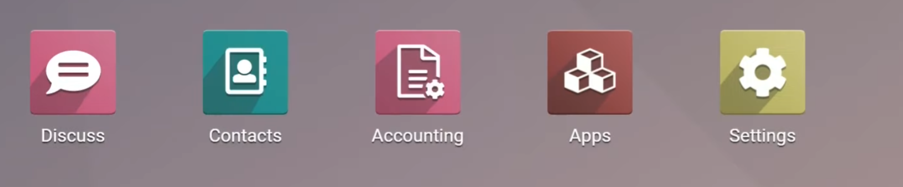
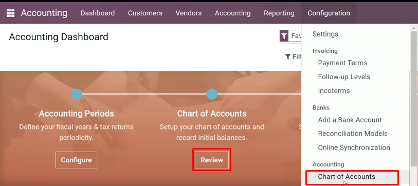
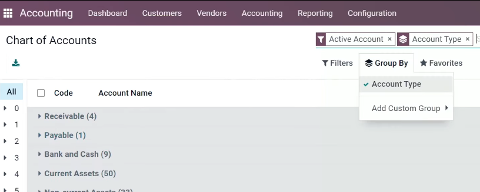
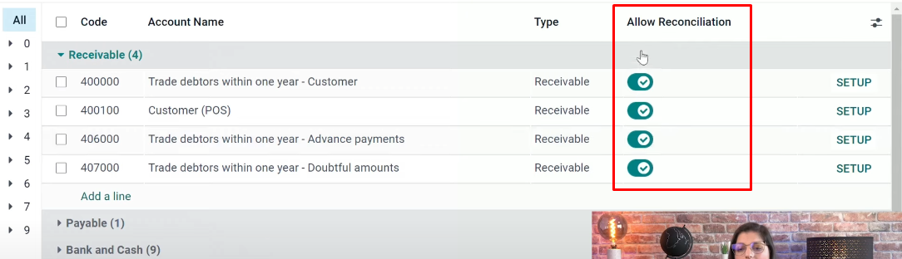
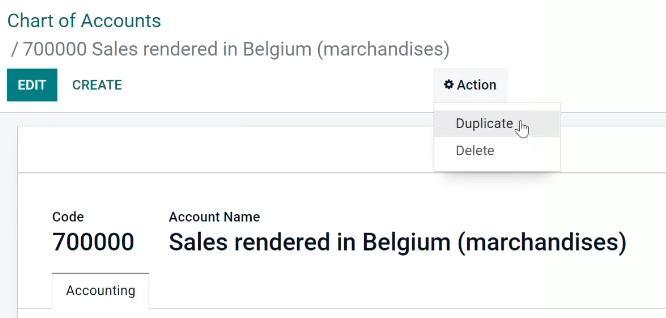
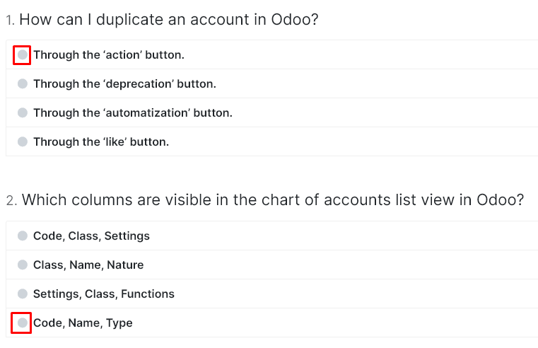

с возвращением, дорогие исполнители, обмен товарами, услугами и финансовыми активами - это транзакции, лежащие в основе
каждой компании, запись их в ваш бухгалтерский учет позволяет вам отслеживать всю деятельность вашей компании, поэтому
вы хотите рассортировать эту транзакцию по различным учетным записям по характеру и использование счета определяет его
тип, конечно, существует несколько типов, и мы собираемся проверить их сейчас,

собственный капитал - это, в основном, стоимость компании, он включает в себя сумму средств, внесенных владельцами,
например,

основные средства они представляют собой долгосрочное богатство компании, как, например, ваш автомобиль или ваши
обязательства по
строительству являются обязательствами из прошлых событий, которые компания должна будет оплатить в будущем, например,
ваш поставщик выставляет счета за текущие активы, они представляют собой краткосрочное богатство компании например,
подумайте о счете клиента, который вы только что выставили, и который ваш клиент еще не оплатил, далее следует
банковский кассовый счет, в котором отражены деньги, которые у вас есть на ваших банковских счетах, или что вы не
являетесь доходом, счета суммируют все доходы вашей компании. создал и, наконец,
счета расходов — это все карты, которые у вас есть для поддержки вашего бизнеса, такие как товары, которые вы продаете
своим клиентам, а также кофе для вашей
команды или все конфеты, которые вы предлагаете своим клиентам,
или не все эти счета перечислены в то, что мы называем чартерными счетами, вы можете думать об этом как о ДНК компании,

давайте сейчас посмотрим вместе, как реализовать это для моей компании, розовые автомобили,
перейдем в бухгалтерское приложение с панели бухгалтерского учета,

у нас есть несколько способов доступа к плану счетов либо из мастеров подключения, здесь мы можем просмотреть чат
счетов, либо из
меню конфигурации,

где мы можем получить к нему прямой доступ, когда мы в чате учетных записей

здесь мы видим список всех учетных записей, особенно здесь для бельгийской бельгийской компании, поэтому я обновил
бельгийскую локализацию напрямую, что дает мне все учетные записи, готовые для Бельгии,
первый столбец посвящен коду, который вы знаете. код уникален, поэтому в основном у вас не может быть двух учетных
записей с одним и тем же номером, что невозможно из списка, вы можете напрямую легко обновить его, поэтому, если вы
хотите изменить его на другой код учетной записи другой учетной записи, это легко

то же самое для имя учетной записи,

а также тип учетной записи, хм, если я хочу увидеть,например, счета дебиторской задолженности, мне легко сгруппировать

по типу учетной записи, и непосредственно я вижу все счета, перечисленные и сгруппированные по типу учетной записи,
поэтому из дебиторской задолженности здесь вы видите, что у меня есть разные,

я когда-либо на урду, нам не нужно создавать столько учетных записей, потому что в основном вы знаете,
у вас есть так много разных инструментов, позволяющих нам фильтровать информацию
и легко идентифицировать ее, не создавая так много учетных записей например, для дебиторской задолженности происходит
то, что у меня может быть одна дебиторская задолженность, но через контактные формы я могу легко отфильтровать мою
патентную книгу или мою дебиторскую задолженность благодаря контактам, которые я создаю и делаю для своих клиентов, так
что одна дебиторская задолженность, но несколько контактные формы, которые вы можете увидеть здесь в счетах дебиторской
задолженности,

активировал функцию согласования сигналов тревоги,

это позволяет мне сверять открытые позиции для этого счета, например, со строками банковской выписки или новыми
платежами, которые я зарегистрировал в своей базе данных,

о, это здорово, так что это означает, что мы можем активировать его во всех учетных записях, ну, это
не очень хорошая идея, если вы хотите это сделать, потому что, если это произойдет, в основном, у вас будут все ваши
открытые элементы, все ваши открытые элементы журнала в интерфейсе сверки, что не является чем-то, что вы хотите, потому
что нет никаких новостей в согласовании всего, 

поэтому вы сохраняете его только для основных основных типов счетов, таких как дебиторская или кредиторская задолженность, скажем, 

теперь, когда я хочу создать новую учетную запись, я
советую всегда создавать из существующей, поэтому мы Я собираюсь продублировать учетную запись, например, в моих учетных
записях доходов, чтобы я мог легко фильтровать через левую сторону фильтра. новый код, который уникален, и имя учетной
записи скопировано, 

поэтому, если я хочу здесь увидеть продажи, например, из le valence, и поместить код учетной записи,
измените его на 15. мне очень легко сделать это, и мне просто нужно сохранить и моя новая учетная запись создана хорошо,

что также важно для учетных записей в ado, так это то, что на основе кода, типа или тегов мы собираемся отфильтровать
все эти учетные записи в юридический отчет, поэтому в зависимости от принципа бухгалтерского учета каждой страны мы
придется создать и адаптировать план счетов в зависимости от этих критериев, поэтому, например, для Бельгии мы знаем,
что код имеет решающее значение для юридического отчета, тогда как для англо-саксонских стран, таких как США и
Великобритания, тип действительно важен, вот и все для меня в этом видео спасибо за просмотр ciao tutti 

