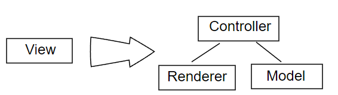

этом документе рассказывается о фреймворке Odoo Javascript. Данный фреймворк не представляет собой какое-то крупное
приложение с точки зрения объема кода, но, не смотря на это, он довольно универсален, потому что это в основном машина,
превращающая декларативное описание интерфейса в живое приложение, способное взаимодействовать с любой моделью и
записями в базе данных. Можно даже использовать веб-клиент для изменения интерфейса веб-клиента.

Html js документации Odoo доступна здесь : JS API

Общее описание
============================
Данный JS фреймворк создан для работы с тремя основными сценариями:

веб-клиент: это веб-приложение, в котором можно просматривать и редактировать бизнес-данные. Приложение защищает доступ
к этим данным. С технической стороны то Single Page Application (SPA) (сама страница не перезагружается, а новые данные
запрашиваются с сервера каждый раз, когда это необходимо)
вебсайт: это часть Odoo доступная всем. Это позволяет любому пользователю просматривать доступный контент, делать
покупки или выполнять множество действий в качестве клиента. Технически - это классический сайт: используются
контроллеры для обработки url маршрутов и генерации html страниц, плюс немного javascript для их работы.
рабочее место кассира: это интерфейс для работы автоматизированных касс. Технически это специальное SPA.
Часть JS кода используется всеми этими сценариями и объединен в один бандл (см. ниже в разделе ассетов). В этом
документе основное внимание будет уделено дизайну веб-клиента.

Web client
============================
SPA
Короче говоря, webClient, экземпляр *WebClient * является корневым компонентом всего пользовательского интерфейса. Его
ответственность заключается в оркестровке всех различных субкомпонентов и предоставлении сервисов, таких как rpcs,
локальное хранилище и многое другое.

Во время работы веб-клиент представляет собой SPA приложение. Оно не запрашивает полную страницу с сервера каждый раз,
когда пользователь выполняет действие. Вместо этого оно запрашивает только те данные, которые ему нужны, а затем
заменяет/обновляет представление. Кроме того, оно управляет URL-адресом: синхронизирует его с состоянием веб-клиента.

Это означает, что, пока пользователь работает в Odoo, класс веб-клиента (и менеджер действий) фактически создает и
уничтожает многие дочерние компоненты. Состояние постоянно меняется, и каждый виджет может быть уничтожен в любое время.

Обзор JS кода веб-клиента
============================
Здесь мы даем очень краткое описание кода веб-клиента в содержащегося в модуле web/static/src/js. Обратите внимание, что
это намеренно и мы не ставим перед собой цель детально все описать. Мы пробежимся только по самым важным файлам/папкам.

    boot.js: это файл, который определяет систему модулей. Его нужно загружать первым.
    core/: это коллекция строительных блоков нижнего уровня. В частности, он содержит систему классов, систему виджетов, инструменты для асинхронной работы и многие другие классы/функции.
    chrome/: в этой папке у нас находятся самые большие виджеты, которые составляют большую часть пользовательского интерфейса.
    chrome/abstract_web_client.js и chrome/web_client.js: вместе эти файлы определяют виджет WebClient, который является корневым виджетом для веб-клиента.
    chrome/action_manager.js: это код, который преобразует действие в виджет (например, Kanban или представление From)
    chrome/search_X.js все эти файлы определяют представление Search (это не представление с точки зрения веб-клиента, только с точки зрения сервера)
    fields: все виджеты поля основного представления определены здесь
    views: это место в котором расположены представления

Управление ассетами
============================
Управление ассетами организовано в Odoo не так просто, как в других приложениях. Одна из причин заключается в том, что
может возникнуть множество ситуаций, когда требуются не все ассеты, а только конкретные. Например, потребности
веб-клиента, рабочего места кассира, веб-сайта или даже мобильного приложения различны. Кроме того, некоторые ассеты
могут быть достаточно объемными и при этом они редко нужны. В этих случаях мы хотим, чтобы они загружались в фоне.

Основная идея заключается в том, что мы определяем содержимое бандла в xml. Бандл здесь определяется как набор файлов (
javascript, css, scss). В Odoo наиболее важные бандлы определены в файле addons/web/views/webclient_templates.xml. Это
выглядит так:

    <template id="web.assets_common" name="Common Assets (used in backend interface and website)">
        <link rel="stylesheet" type="text/css" href="/web/static/lib/jquery.ui/jquery-ui.css"/>
        ...
        
        ...
    </template>

Файлы в бандл можно вставить в шаблон с помощью директивы t-call-assets:

    <t t-call-assets="web.assets_common" t-js="false"/>
    <t t-call-assets="web.assets_common" t-css="false"/>

Вот что происходит, когда шаблон рендерится сервером с этими директивами:

все файлы scss, описанные в бандле, будут скомпилированы в файлы css. Файл с именем file.scss будет скомпилирован в файл
с именем file.scss.css.

# если мы находимся в режиме debug=assets,

- директива t-call-assets с атрибутом t-css установленном в false будет заменен списком тегов таблицы стилей,
  указывающих на файлы CSS
- директива t-call-assets с атрибутом t-js, установленным в false, будет заменена списком тегов скриптов, указывающих на
  файлы js

# если мы не находимся в режиме debug=assets,

- CSS-файлы будут объединены и минифицированы, а затем будет создан тег таблицы стилей
- js-файлы будут объединены и минифицированы, а затем будет создан тег javascript

- Обратите внимание, что файлы ассетов кэшируются, поэтому теоретически браузер должен загружать их только один раз.

Основные бандлы
============================

Когда сервер Odoo запускается, он проверяет временную метку каждого файла в бандле и при необходимости
создает/переделвыет соответствующие бандлы.

Вот несколько важных бандлов, которые большинству разработчиков нужно знать:

# web.assets_common:

этот бандл содержит большинство ресурсов необходимых для веб-клиента, веб-сайта, а также рабочего места кассира.
Предполагается, что он содержит строительные блоки более низкого уровня для платформы odoo. Обратите внимание, что он
содержит файл boot.js, который определяет систему модулей odoo.

# web.assets_backend:

этот бандл содержит код для веб-клиента (в частности, веб-клиент/менеджер действий/представления)

# web.assets_frontend:

этот бандл содержит все что нужно для работы веб-сайта: интернет-магазин, форум, блог, управление событиями, …

Добавление файла в качестве ассета в бандл
============================
Правильный способ добавить файл, расположенный в addons/web, в бандл очень прост: достаточно просто добавить тег script
или stylesheet в бандл в файле webclient_templates.xml. Но когда мы работаем в другом модуле, нам нужно добавить файл из
этого самого модуля. Вам нужно выполнить три шага:

- добавьте фалй assets.xml в каталог views/
- добавьте строку views/assets.xml в ключ data в файле манифеста
- создайте представление для наследования желаемого бандла и добавьте файл(ы) с выражением xpath. Например,

        <template id="assets_backend" name="helpdesk assets" inherit_id="web.assets_backend">
            <xpath expr="//script[last()]" position="after">
                <link rel="stylesheet" type="text/scss" href="/helpdesk/static/src/scss/helpdesk.scss"/>
                
            </xpath>
        </template>

Обратите внимание, что файлы в бандле загружаются сразу же, когда пользователь загружает веб-клиент odoo. Это означает,
что файлы передаются по сети каждый раз (кроме тех случаев, когда кеш браузера активен). Иногда может быть лучше
загрузить часть ассетов в фоне. Например, если для работы виджета требуется большая библиотека, и этот виджет не
является основной частью работы пользователя, тогда хорошей идеей может стать загрузка библиотеки только в момент
создания виджета. Класс виджета имеет встроенную поддержку для такого варианта использования. (см. раздел Генератор
шаблонов QWeb)

Что делать если файл не загружается/обновляется
============================
Причин такого поведения может быть много. Вот несколько советов, которые могу помочь решить эту проблему:

- когда сервер уже запущен он не знает, был ли изменен файл ассета. Поэтому, вы можете просто перезапустить сервер,
  чтобы ассеты были пересобраны.
- проверьте консоль браузера (в инструментах разработчика, обычно открываемых с помощью F12), чтобы убедиться в
  отсутствии явных ошибок
- попробуйте добавить console.log в начале вашего файла (до определения любого модуля), чтобы вы могли увидеть, был файл
  загружен или нет
- в пользовательском интерфейсе в режиме отладки (ВСТАВЬТЕ ССЫЛКУ ЗДЕСЬ ДЛЯ ПЕРЕХОДА РЕЖИМ ОТЛАДКИ) есть опция,
  заставляющая сервер обновлять свои файлы ассетов.
- используйте режим debug=assets. Это фактически напрямую загрузит файлы ассетов объявленных в бандлах (обратите
  внимание, что это на самом деле не решает проблему. Сервер все еще использует устаревшие бандлы)
- наконец, наиболее удобный способ сделать это для разработчика - запустить сервер с параметром - dev=all. Это
  активирует параметры средства просмотра файлов, которые автоматически аннулируют ресурсы при необходимости. Обратите
  внимание, что это не очень хорошо работает на ОС Windows.
- и главное не забывайте обновлять страницу (прим.пер. Желательно со сбросом кэша)!
- или просто сохраните ваш файл…

После того, как файл ассета был заново создан, вам необходимо обновить страницу, чтобы перезагрузить нужные файлы (не
забываем про то, что файлы могут быть кэшированы и перезагружаем со сбросом кэша).

Система модулей JavaScript
============================
Как только мы смогли загрузить наши файлы javascript в браузер, мы должны убедиться, что они загружены в правильном
порядке. Для этого в Odoo определена небольшая модульная система (находится в файле*addons/web/static/src/js/boot.js*,
который должен быть загружен первым).

# функции define

Система модулей Odoo, вдохновленная AMD, работает путем определения функции define для глобального объекта odoo. Затем
мы определяем каждый модуль javascript, вызывая эту функцию. В платформе Odoo модуль представляет собой фрагмент кода,
который будет выполнен в максимально короткие сроки. У него есть имя и, возможно, зависимости. Когда его зависимости
загружены, модуль также будет загружен. Значением модуля это возвращаемое значение функции, определяющей модуль.

Вот небольшой пример:

    // in file a.js
    odoo.define('module.A', function (require) {
        "use strict";
    
        var A = ...;
    
        return A;
    });

    // in file b.js
    odoo.define('module.B', function (require) {
        "use strict";
    
        var A = require('module.A');
    
        var B = ...; // something that involves A
    
        return B;
    });

Альтернативный способ определения модуля заключается в явном предоставлении списка зависимостей во втором аргументе.

    odoo.define('module.Something', ['module.A', 'module.B'], function (require) {
        "use strict";
    
        var A = require('module.A');
        var B = require('module.B');
    
        // some code
    });

Если некоторые зависимости отсутствуют/не готовы, модуль просто не будет загружен. Через несколько секунд в консоли
браузера появится предупреждение.

Циклические зависимости не поддерживаются. Это имеет смысл, но это означает, что нужно быть осторожным.

Определение модуля
============================
Метод odoo.define
============================
предоставляет три аргумента:

# moduleName:

имя модуля JavaScript. Это должна быть уникальная строка. По соглашение имя модуля javascript должно иметь иметь имя
модуля odoo, сопровожденное определенным описанием. Например, «web.Widget» описывает модуль, определенный в модуле web,
который экспортирует класс Widget (потому что первая буква заглавная)

Если имя не уникальное, то вы увидите возникшее исключение в консоли браузера.

# dependencies:

второй аргумент не является обязательным. Если он существует, то это должен быть список строк, каждая из которых
соответствует модулю javascript. Здесь описываются зависимости, которые необходимо загрузить перед выполнением модуля.
Если зависимости здесь не указаны явно, то система модулей извлечет их из функции, вызвав для нее toString, а затем с
помощью регулярного выражения найдет все операторы require.

      odoo.define('module.Something', ['web.ajax'], function (require) {
        "use strict";
    
        var ajax = require('web.ajax');
    
        // some code here
        return something;
    });

# функция

наконец, последний аргумент - это функция, которая определяет модуль. Его возвращаемое значение - это значение модуля,
которое может быть передано другим модулям, зависящим от него. Обратите внимание, что существует исключение для
асинхронных модулей, см. Следующий раздел.

Если произойдет ошибка, она будет добавлена в лог (в режиме отладки) в консоль браузера:

- Missing dependencies: эти модули не отображаются на странице. Возможно, что файл JavaScript отсутствует на странице
  или что имя модуля указано неверно
- Failed modules: Обнаружена ошибка javascript
- Rejected modules: Модул вернул сброшенный Promise. И он (как и зависимые от него модули) не загрузился.
- Rejected linked modules: Модули который зависят от сброшенного модуля
- Non loaded modules: Модули которые зависят от пропущенного или не загрузившегося модуля

Асинхронные модули
============================
Может случиться так, что модуль должен выполнить некоторую работу, прежде чем он будет готов. Например, он может сделать
запрос RPC для загрузки нужных данных. В этом случае модуль может просто вернуть Promise. Тогда система модулей просто
будет ждать выполнения Promise, прежде чем зарегистрировать модуль.

    odoo.define('module.Something', function (require) {
        "use strict";
    
        var ajax = require('web.ajax');
    
        return ajax.rpc(...).then(function (result) {
            // some code here
            return something;
        });
    });

Best practices
============================

- помните соглашение для имени модуля: имя модуля odoo с суффиксом имя модуля javascript.
- объявляйте все свои зависимости в верхней части модуля. Кроме того, они должны быть отсортированы в алфавитном порядке
  по названию модуля. Это упрощает понимание вашего модуля.
- объявляйте весь экспорт в конце
- старайтесь не экспортировать слишком много сущностей из одного модуля. Лучше просто экспортировать по принципу: одна
  сущность - один маленький модуль.
- асинхронные модули могут быть использованы для упрощения различных ситуаций. Например, модуль web.dom_ready возвращает
  Promise, которое будет выполнено, когда DOM будет фактически готов. Таким образом, другой модуль, которому требуется
  DOM, может просто где-то иметь инструкцию require(„web.dom_ready“), и код будет выполняться после того как DOM будет
  готов.
- Старайтесь избегать определения более одного модуля в одном файле. Это может быть удобно в краткосрочной перспективе,
  но на деле это сложнее поддерживать.

Система классов
============================
Javascript фрейворк Odoo был разработан до того, как стали доступны классы ECMAScript 6. В Ecmascript 5 стандартным
способом определения класса является определение функции и добавление методов к ее объекту-прототипу. Это конечно
хорошо, но несколько геморно, в тех случаях когда мы хотим использовать наследование и миксины.

По этим причинам, мы в Odoo решили использовать свою систему классов вдохновленную John Resig. Базовый класс находится в
модуле web.Class, файла class.js.

Создание подкласса - метод extended
============================

Давайте обсудим, как создаются классы. Основной механизм это использование метода extended (что очень похоже на
extension в классах ES6).

    var Class = require('web.Class');
    
    var Animal = Class.extend({
        init: function () {
            this.x = 0;
            this.hunger = 0;
        },
        move: function () {
            this.x = this.x + 1;
            this.hunger = this.hunger + 1;
        },
        eat: function () {
            this.hunger = 0;
        },
    });

В этом примере функция init является конструктором. Она будет вызвана при создании экземпляра. Создание экземпляра
выполняется с помощью ключевого слова new.

Наследование
============================
Удобно иметь возможность наследовать существующий класс. Это делается с помощью метода extended в родительском классе.
Когда метод вызывается, фреймворк тайно перепривязывает специальный метод: _super к вызываемому в настоящее время
методу. Это позволяет нам использовать this._super всякий раз, когда нам нужно вызвать родительский метод.

    var Animal = require('web.Animal');
    
    var Dog = Animal.extend({
        move: function () {
            this.bark();
            this._super.apply(this, arguments);
        },
        bark: function () {
            console.log('woof');
        },
    });
    
    var dog = new Dog();
    dog.move()

Миксины
============================
Система классов odoo не поддерживает множественное наследование, но для тех случаев, когда нам нужно поделиться каким
либо функционалом, у нас есть система миксинов: метод extended может фактически принимать произвольное количество
аргументов и объединит их все в новый класс.

    var Animal = require('web.Animal');
    var DanceMixin = {
        dance: function () {
            console.log('dancing...');
        },
    };
    
    var Hamster = Animal.extend(DanceMixin, {
        sleep: function () {
            console.log('sleeping');
        },
    });

Вот пример, класс Hamster является дочерним классом Animal, к которому так же «подмешан» DanceMixin.

Изменение существующего класса
============================

Не часто, но иногда нужно изменить другой класс на месте. Цель - иметь механизм для изменения класса и всех
будущих/действующих экземпляров. Это делается с помощью метода include:

    var Hamster = require('web.Hamster');
    
    Hamster.include({
        sleep: function () {
            this._super.apply(this, arguments);
            console.log('zzzz');
        },
    });

Очевидно это опасная операция, и ее следует выполнять с осторожностью. Но в связи тем, как устроена Odoo быывает, что
иногда необходимо изменить поведение виджета/класса, определенного в другом модуле. Обратите внимание, что изменятся все
экземпляры класса, даже если они уже были созданы.

Виджеты
============================
Класс Widget один из наиболее важных строительных блоков пользовательского интерфейса. Практически все в
пользовательском интерфейсе находится под контролем виджета. Класс Widget определен в модуле web.Widget файла widget.js.

Если вкратце то вот что включают в себя функции, предоставляемые классом Widget:

следит за отношениями родитель/наследник между виджетами (PropertiesMixin)
расширенное управление жизненным циклом с функциями безопасности (например
автоматическое уничтожение дочерние виджеты при уничтожении родителя)
автоматический рендеринг с помощью qweb
различные вспомогательные функции, помогающие взаимодействовать с внешним окружением.
Вот простой пример виджета счетчика:

    var Widget = require('web.Widget');
    
    var Counter = Widget.extend({
        template: 'some.template',
        events: {
            'click button': '_onClick',
        },
        init: function (parent, value) {
            this._super(parent);
            this.count = value;
        },
        _onClick: function () {
            this.count++;
            this.$('.val').text(this.count);
        },
    });

В этом примере мы предполагаем, что шаблон some.template (загружен правильно: шаблон находится в файле, который
правильно определен в ключе qweb в манифесте модуля) определяется как:

    

        <t t-esc="widget.count"/>
        <button>Increment</button>
    

Этот пример виджета можно использовать следующим образом:

    // Create the instance
    var counter = new Counter(this, 4);
    // Render and insert into DOM
    counter.appendTo(".some-div");

Этот пример иллюстрирует несколько функций класса Widget, включая систему событий, систему шаблонов, конструктор с
начальным аргументом parent.

Жизненный цикл виджета
============================
Как и во многих системах компонентов, класс виджетов имеет четко определенный жизненный цикл. Обычный жизненный цикл
следующий: вызывается init, затем willStart, затем выполняется рендеринг, затем start и наконец destroy.

# Widget.init(parent)

это конструктор. Предполагается, что метод init инициализирует базовое состояние виджета. Он работает синхронно и может
быть переопределен так, чтобы получить больше параметров от создателя/родителя виджета

Аргументы
parent (Widget()) – родитель нового виджета, используемый для обеспечения автоматического уничтожения и исполнения
событий. Может быть null, если мы не желаем, чтобы виджет не имел родителя.

# Widget.willStart()

этот метод будет вызываться фреймворком один раз при создании виджета и в процессе добавления к DOM. Метод willStart -
это хук, который должен возвращать Promise. JS фреймворк будет ждать его выполнения, прежде чем перейти к шагу
рендеринга. Обратите внимание, что на данный момент виджет не имеет корневого элемента DOM. Хук willStart в полезен для
выполнения асинхронных задач, таких как выборка данных с сервера

# [Rendering]()

Этот шаг автоматически выполняется фреймворком. Он проверяет, определен ли ключ шаблона в виджете. Если да, то
отреднерит этот шаблон с ключом widget, связанным с виджетом в контексте рендеринга (см. Пример выше: мы используем
widget.count в шаблоне QWeb для чтения значения из виджета ). Если шаблон не определен, мы читаем ключ tagName и создаем
соответствующий элемент DOM. Когда рендеринг завершен, мы устанавливаем результат как свойство $el для этого виджета.
После этого мы автоматически связываем все события в событиях и ключах custom_events.

# Widget.start()

когда рендеринг будет завершен, фреймворк автоматически вызовет метод start. Это полезно для выполнения
специализированных задач. Например, настройка библиотеки.

Необходимо вернуть Promise, чтобы указать, когда его работа выполнена.

Результат promise

# Widget.destroy()

Это последний шаг в жизни виджета. Когда виджет уничтожается, мы выполняем все необходимые операции очистки: удаление
виджета из дерева компонентов, открепление всех событий, …

Вызывается автоматически, когда родительский элемент виджета уничтожается, должен вызываться явно, если у виджета нет
родительского элемента или он удален, но его родительский элемент остается.

Обратите внимание, что willStart и метод start не обязательно вызываются. Виджет можно создать (если вызвать метод
init), а затем уничтожить (метод destroy), даже не добавив его в DOM. Если это так, willStart и start даже не будут
вызваны.

API Виджетов
============================

# Widget.tagName

Используется, если виджет не имеет определенного шаблона. По умолчанию div, будет использоваться в качестве имени тега
для создания элемента DOM, который будет установлен как корень DOM виджета. Можно дополнительно настроить этот
сгенерированный корень DOM со следующими атрибутами:

# Widget.id

Используется для генерации атрибута id в корне сгенерированного DOM. Обратите внимание, что это редко требуется и
потенциально узким местом будет, если виджет можно использовать более одного раза.

# Widget.className

Используется для генерации атрибута class в корне сгенерированного DOM. Обратите внимание, что на самом деле он может
содержать более одного класса css: „some-class other-class“

# Widget.attributes

Сопоставление (строковый объект) имен атрибутов с значениями атрибутов. Каждая из пар ключ: значение будет установлена
как атрибут DOM в корне сгенерированного DOM.

# Widget.el

исходный элемент DOM, установленный как корень для виджета (доступен только после запуска метода жизненного цикла)

# Widget.$el

jQuery обертка вокруг el. (доступно только после запуска метода жизненного цикла)

# Widget.template

Должно быть установлено имя QWeb шаблона. Если установлено, шаблон будет рендериться после инициализации виджета, но до
его запуска. Корневой элемент, сгенерированный шаблоном, будет установлен как корневой DOM виджета.

# Widget.xmlDependencies

Список путей к XML-файлам, которые необходимо загрузить перед тем, как виджет может быть отрендерен. Это не приведет к
загрузке уже загруженных элементов. Такой подход полезен, когда вы хотите загружать свои шаблоны в фоне, или если вы
хотите разделить использование виджета между веб-сайтом и интерфейсом веб-клиента.

    var EditorMenuBar = Widget.extend({
        xmlDependencies: ['/web_editor/static/src/xml/editor.xml'],
        ...

# Widget.events

События - это сопоставление селектора событий (имя события и необязательный селектор CSS, разделенные пробелом) и
колбэка. Колбэк может быть именем метода виджета или функционального объекта. В любом случае, this будет установлен в
widget

    events: {
        'click p.oe_some_class a': 'some_method',
        'change input': function (e) {
            e.stopPropagation();
        }
    },

Селектор используется для передачи событий фрейворку jQuery, данный колбэк будет инициирован только для потомков
элемента DOM, соответствующих селектору. Если селектор не указан (указывается только имя события), событие будет
установлено непосредственно в корне DOM виджета.

Примечание: использование встроенной функции не рекомендуется, и, вероятно, будет в будущем будет удалено.

# Widget.custom_events

это почти то же самое, что и атрибут events, но ключами являются произвольные строкам. Они представляют бизнес-события,
запускаемые вспомогательными виджетами. Когда событие инициируется, оно «всплывает» в дереве виджетов (подробности в
разделе «Связь с компонентами»).

# Widget.isDestroyed()

Результат true если виджет собирается или будет уничтожен, false в остальных случаях

# Widget.$(selector)

Применяет CSS-селектор, указанный в качестве параметра к корню DOM виджета:

    this.$(selector);

функционально идентичен:

    this.$el.find(selector);

Аргументы
selector (String) – Селектор CSS
Результат Объект jQuery
Этот вспомогательный метод похож на Backbone.View.$

# Widget.setElement(element)

Переустанавливает корень DOM виджета на предоставленный элемент, также обрабатывает повторную установку различных
алиасов корня DOM, а также отмену и переустановку делегированных событий.

Аргументы
element (Element) – Элемент DOM или объект jQuery для установки в качестве корня DOM виджета

Добавление виджета в DOM
================================

# Widget.appendTo(element)

Рендерит виджет и вставляет его в качестве последнего потомка целевого объекта, использует .appendTo()

# Widget.prependTo(element)

Рендерит виджет и вставляет его в качестве первого потомка цели, использует .prependTo()

# Widget.insertAfter(element)

Рендерит виджет и вставляет его зразу целевым элементом, использует .insertAfter()

# Widget.insertBefore(element)

Рендерит виджет и вставляет его перед целевым элементом, использует`.insertBefore()`_

Все эти методы принимают то же, что принимает соответствующий метод jQuery (селектор CSS, узлы DOM или объекты jQuery).
Все они возвращают promise и отвечают за три задачи:

- Рендеринг корневого элемента виджета с помощью renderElement()
- вставка корневого элемента виджета в DOM с использованием любого подходящего jQuery
  метода, которому они соответствуют
- запуск виджета и возврат результата его запуска

Правила оформления виджетов
================================

# Старайтесь избегать идентификаторов (атрибут id)

В общих приложениях и модулях id ограничивает возможность повторного использования компонентов и делает код более
хрупким. В большинстве случаев они могут быть просто удалены, заменены классами или содержать ссылку на узел DOM или
элемент jQuery.

Если id вам абсолютно необходим (например потому что этого требует сторонняя библиотека), то id должен быть частично
сгенерирован с помощью _uniqueId(), например:

    this.id = _.uniqueId('my-widget-');

# Избегайте предсказуемых/общих имен классов CSS.

Имена классов, такие как «content» или «navigation», могут соответствовать желаемому смыслу/семантике, но вполне
вероятно что другой разработчик будет точно так же, создавая конфликт имен и непонятное поведение. Имена универсальных
классов должны начинаться с префикса, например, именем компонента, к которому они принадлежат (создание «неформальных»
пространств имен, как в C или Objective-C).

# Следует избегать глобальных селекторов.

Так как компонент может использоваться несколько раз на одной странице (пример в Dashboard), запросы должны быть
ограничены областью заданного компонента. Непродуманные варианты, такие как $(selector) или document.querySelectorAll(
selector), обычно приводят к непредсказуемому поведению. Класс Widget() имеет атрибут, предоставляющий свой корень DOM (
$el), и ссылку для выбора узлов напрямую ($()).

# В целом исходите из того, что ваши компоненты не владеют и не контролируют что-либо за пределами своего личного $el

(поэтому избегайте использования ссылки на родительский виджет)

# Html шаблонизатор/рендеринг должен использовать QWeb, если он не является очень простым.

# Все интерактивные компоненты (компоненты, отображающие информацию на экране или перехватывающие события DOM) должны наследовать Widget()

и правильно реализовывать и использовать свой API и жизненный цикл.

# Не забудьте дождаться start, прежде чем использовать $el,

например:

    var Widget = require('web.Widget');
    
    var AlmostCorrectWidget = Widget.extend({
        start: function () {
            this.$el.hasClass(....) // in theory, $el is already set, but you don't know what the parent will do with it, better call super first
            return this._super.apply(arguments);
        },
    });
    
    var IncorrectWidget = Widget.extend({
        start: function () {
            this._super.apply(arguments); // the parent promise is lost, nobody will wait for the start of this widget
            this.$el.hasClass(....)
        },
    });
    
    var CorrectWidget = Widget.extend({
        start: function () {
            var self = this;
            return this._super.apply(arguments).then(function() {
                self.$el.hasClass(....) // this works, no promise is lost and the code executes in a controlled order: first super, then our code.
            });
        },
    });

Генератор шаблонов QWeb
================================
Веб-клиент использует генератор шаблонов QWeb для рендерирга виджетов (если они не переопределяют метод renderElement
для выполнения чего-то еще). Движок Qweb JS основан на XML и в большинстве случаев совместим с реализацией на Python.

Теперь давайте объясним, как загружаются шаблоны. Всякий раз, когда запускается веб-клиент, выполняется RPC запрос к
url-маршруту /web/webclient/qweb. Затем сервер вернет список всех шаблонов, определенных в файлах данных для каждого
установленного модуля. Нужные файлы перечислены по ключу qweb в манифесте каждого модуля.

Веб-клиент будет ждать загрузки этого списка шаблона, прежде чем запускать свой первый виджет.

Этот механизм работает в целом неплохо, но иногда мы хотим загрузить шаблон в фоне. Например, представьте, что у нас
есть виджет, который используется редко. В этом случае, вероятно, мы предпочитаем не загружать его шаблон в основной
файл, чтобы сделать веб-клиент немного легче. В этом случае мы можем использовать ключ виджета xmlDependencies:

    var Widget = require('web.Widget');
    
    var Counter = Widget.extend({
        template: 'some.template',
        xmlDependencies: ['/myaddon/path/to/my/file.xml'],
    
        ...
    
    });

При этом виджет Counter загрузит файлы указанные в xmlDependencies при работе метода willStart, поэтому шаблон будет
готов к выполнению рендеринга.

Система событий
================================
В настоящее время Odoo поддерживает две системы событий: простую систему, которая позволяет добавлять слушателей и
инициировать события, и более совершенную систему, которая заставляет события «всплывать».

Обе эти системы событий реализованы в EventDispatcherMixin, в файле mixins.js. Этот миксин входит в класс Widget.

Базовая система обмена сообщениями
================================
Эта система событий была исторически первой. Он реализует простой шаблон шины. У нас есть 4 основных метода:

* on: используется для регистрации слушателя на событии.
* off: полезна открепления слушателя от события.
* once: используется для регистрации слушателя, который будет вызываться только один раз.
* trigger: инициировать событие. Вызывает каждого слушателя.

Вот пример того, как можно использовать эту систему событий:

    var Widget = require('web.Widget');
    var Counter = require('myModule.Counter');
    
    var MyWidget = Widget.extend({
        start: function () {
            this.counter = new Counter(this);
            this.counter.on('valuechange', this, this._onValueChange);
            var def = this.counter.appendTo(this.$el);
            return Promise.all([def, this._super.apply(this, arguments)]);
        },
        _onValueChange: function (val) {
            // do something with val
        },
    });
    
    // in Counter widget, we need to call the trigger method:
    
    ... this.trigger('valuechange', someValue);

# Предупреждение

использование этой системы событий не рекомендуется, мы планируем заменить каждый метод trigger на метод trigger_up из
расширенной системы событий

Расширенная система событий
================================
Пользовательские события виджетов - это более продвинутая система, которая имитирует API событий DOM. Всякий раз, когда
событие инициируется, оно «всплывает» в дереве компонентов, пока не достигнет корневого виджета или не будет
остановлено.

# trigger_up:

это метод, который создаст OdooEvent и отправит(задиспатчит) его в дерево компонентов. Обратите внимание, что это
начнется с компонента, который вызвал событие

# custom_events:

это эквивалент словаря event, но для событий odoo.
Класс OdooEvent очень прост. Он имеет три публичных атрибута: target (виджет, который вызвал событие), name (имя
события) и data (полезная нагрузка). Он также имеет 2 метода: stopPropagation и is_stopped.

Предыдущий пример можно обновить, чтобы использовать пользовательскую систему событий:

    var Widget = require('web.Widget');
    var Counter = require('myModule.Counter');
    
    var MyWidget = Widget.extend({
        custom_events: {
            valuechange: '_onValueChange'
        },
        start: function () {
            this.counter = new Counter(this);
            var def = this.counter.appendTo(this.$el);
            return Promise.all([def, this._super.apply(this, arguments)]);
        },
        _onValueChange: function(event) {
            // do something with event.data.val
        },
    });
    
    // in Counter widget, we need to call the trigger_up method:
    
    ... this.trigger_up('valuechange', {value: someValue});

Реестр
=============================
Основной необходимостью в экосистеме Odoo является расширение/изменение поведения базовой системы извне (путем установки
приложения, то есть другого модуля). Например, может потребоваться добавить новый тип виджета для какого-то
представления. Как правило, вы создаете нужный компонент, а затем добавление его в реестр (этап регистрации), чтобы
остальная часть веб-клиента знала о его существовании.

В системе доступно несколько реестров:

# реестр полей (экспортируется через web.field_registry).

Поле реестра содержит
все виджеты полей известные веб-клиенту. Всякий раз, когда представлению (чаще всего это Form, List или Kanban) нужен
виджет поля, именно здесь клиент и будет его искать. Типичный пример использования выглядит следующим образом:

    var fieldRegistry = require('web.field_registry');
    
    var FieldPad = ...;
    
    fieldRegistry.add('pad', FieldPad);

Обратите внимание, что каждое значение должно быть подклассом AbstractField

# реестр представлений:

этот реестр содержит все представления JS, известные веб-клиенту
(и в том числе менеджер представлений). Каждое значение этого реестра должно быть подклассом AbstractView

# Реестр действий:

мы отслеживаем все действия клиента в этом реестре.
Именно здесь менеджер действий ищет каждый раз, когда ему нужно создать клиентское действие. В версии 11 каждое значение
должно быть просто подклассом Widget. Однако в версии 12 значения должны быть AbstractAction.

Коммуникация между виджетами
================================
Существует множество путей для коммуникации между компонентами.

# От родительского компонента к дочернему:

это простой случай. Родительский виджет может просто вызвать метод своего потомка:

    this.someWidget.update(someInfo);

# От виджета к его родителю/более далекому предку:

в этом случае работа виджета состоит в том, чтобы просто уведомить его окружение о том, что что-то произошло. Поскольку
мы не хотим, чтобы виджет имел ссылку на своего родителя (это связывало бы виджет с реализацией его родителя), наилучшим
способом для таких случаев является запуск события, которое будет «всплывать» в дереве компонентов, используя метод
trigger_up:

    this.trigger_up('open_record', { record: record, id: id});

Это событие будет вызвано в виджете, затем «всплывет» и будет в конечном итоге перехвачено кем-то из его предков:

    var SomeAncestor = Widget.extend({
        custom_events: {
            'open_record': '_onOpenRecord',
        },
        _onOpenRecord: function (event) {
            var record = event.data.record;
            var id = event.data.id;
            // do something with the event.
        },
    });

# Межкомпнентное взаимодействие:

Межкомпонентное взаимодействие достигается с помощью шины. Это не самый корректный способ общения, т.к. он усложненяет
поддержку кода. Тем не менее, он имеет преимущество, которое закючается в том что он позволяет взаимодействовать
несвязанным компонентам. Вы просто прослушиваете событие на шине. Например:

    // in WidgetA
    var core = require('web.core');
    
    var WidgetA = Widget.extend({
        ...
        start: function () {
            core.bus.on('barcode_scanned', this, this._onBarcodeScanned);
        },
    });
    
    // in WidgetB
    var WidgetB = Widget.extend({
        ...
        someFunction: function (barcode) {
            core.bus.trigger('barcode_scanned', barcode);
        },
    });

В этом примере мы используем шину, экспортированную из web.core, но это не обязательно. Шина может быть создана для
определенной цели.

Сервисы
================================
В версии 11.0 мы ввели понятие *service *. Основная идея состоит в том, чтобы предоставить субкомпонентам контролируемый
способ доступа к их окружению, таким образом, чтобы фреймворк был контролируемым и тестируемым.

Система серсисов организована вокруг трех идей: сервисы, провайдеры сервисов и виджеты. Это работает так: виджеты
инициируют (с помощью trigger_up) события, эти события всплывают перед провайдером, который попросит сервис выполнить
задачу, а затем, возможно, вернет ответ.

Сервис
================================
Сервис является экземпляром класса AbstractService. В основном это имя и несколько методов. Его задача - выполнять
какую-то работу, обычно это зависит от конкретного окружения.

Например, у нас есть сервис ajax (работа заключается в выполнении запросов rpc), localStorage (взаимодействие с
локальным хранилищем браузера) и многие другие.

Вот упрощенный пример того, как реализован сервис ajax:

    var AbstractService = require('web.AbstractService');
    
    var AjaxService = AbstractService.extend({
        name: 'ajax',
        rpc: function (...) {
            return ...;
        },
    });

Этот сервис называется ajax и определяет один метод, rpc.

Провайдер сервиса
================================
Чтобы сервисы работали, необходимо, чтобы у нас был провайдер, готовый отправлять пользовательские события. В backend (
веб-клиент) это делается основным экземпляром веб-клиента. Обратите внимание, что код для провайдера взят из
ServiceProviderMixin.

Виджет
================================
Виджет - это та часть, которая запрашивает сервис. Для этого он просто запускает событие call_service (обычно с помощью
вспомогательной функции call). Это событие всплывет и передаст интент остальной части системы.

На практике некоторые функции вызываются так часто, что у нас есть несколько вспомогательных функций, облегчающих их
использование. Например, метод *_rpc *, который помогает осуществлять запросы rpc.

    var SomeWidget = Widget.extend({
        _getActivityModelViewID: function (model) {
            return this._rpc({
                model: model,
                method: 'get_activity_view_id'
            });
        },
    });

# Предупреждение

Если виджет уничтожен, он будет отделен от основного дерева компонентов и не будет иметь родителя. В этом случае события
не будут «всплывать», что означает, что работа не будет выполнена. Это как раз то поведение, которое мы ожидаем от
уничтоженного виджета.

Запрсы RPC
================================
Функциональность rpc запросов предоставляется службой ajax. Но большинство людей будет взаимодействовать только со
вспомогательной функцией _rpc.

При работе с Odoo есть два варианта использования: одному может потребоваться вызвать метод в модели (python) (это
происходит через контроллер call_kw), или может потребоваться непосредственный вызов контроллера (доступного по какому
то url-маршруту).

# Вызов методе в модели python:

    return this._rpc({
        model: 'some.model',
        method: 'some_method',
        args: [some, args],
    });

# Прямой вызов контроллера:

    return this._rpc({
        route: '/some/route/',
        params: { some: kwargs},
    });

Уведомления
================================
Фреймворк Odoo имеет стандартный способ передачи различной информации пользователю - это уведомления, которые
отображаются в правом верхнем углу пользовательского интерфейса.

Существует два типа уведомлений:

# notification:

полезно для предоставления пользователю обратной связи. Например уведомление при отписке от канала.

# warning:

полезно для отображения важной/срочной информации. Как правило, большинство видов (исправимых) ошибок в системе.
Кроме того, уведомления могут использоваться, чтобы задать вопрос пользователю, не нарушая его рабочий процесс.
Представьте себе телефонный звонок, полученный через VOIP: уведомление может отображаться с двумя кнопкамт Принять и
Отклонить.

Система уведомлений
================================
Система уведомлений в Odoo состоит из следующих компонентов:

# Notification:

это простой виджет, который предназначен для создания и отображения с необходимой информации

# NotificationService:

служба, ответственная за создание и уничтожение уведомлений (с помощью custom_event). Обратите внимание, что веб-клиент
в этом случае является провайдером сервиса.

# клиентское действие display_notification:

позволяет запустить отображение уведомления со стороны python кода( в вызываемом методе, при нажатии на кнопку
type=object).

# две вспомогательные функции в ServiceMixin: do_notify и do_warn

Отображение уведомлений
================================

Наиболее распространенный способ отображения уведомлений - использование двух методов, которые взяты из ServiceMixin:

# do_notify(title, message, sticky, className):

Отображает уведомление типа notification.

- title: строка. То что будет отображаться сверху как заголовок
- sticky: логическое, необязательный параметр. Если true, уведомление будет оставаться, пока пользователь не закроет
  его. В противном случае уведомление будет автоматически закрыто после небольшой задержки.
- className: строка, необязательный параметр. Имя класса CSS, которое будет автоматически добавлено в уведомление. Может
  быть полезно для присвоение своих стилей, даже если их использование и не нужно.

# do_warn(title, message, sticky, className):

Отображает уведомление типа warning.

* title: строка. То что будет отображаться сверху как заголовок
* message: строка, содержание уведомления
* sticky: логическое, необязательный параметр. Если true, уведомление будет оставаться, пока пользователь не закроет
  его. В противном случае уведомление будет автоматически закрыто после небольшой задержки.
* className: строка, необязательный параметр. Имя класса CSS, которое будет автоматически добавлено в уведомление. Может
  быть полезно для присвоение своих стилей, даже если их использование и не нужно.

Здесь два примера как использовать эти методы:

    // note that we call _t on the text to make sure it is properly translated.
    this.do_notify(_t("Success"), _t("Your signature request has been sent."));
    
    this.do_warn(_t("Error"), _t("Filter name is required."));

Вот пример на python:

    # note that we call _(string) on the text to make sure it is properly translated.
    def show_notification(self):
        return {
            'type': 'ir.actions.client',
            'tag': 'display_notification',
            'params': {
                'title': _('Success'),
                'message': _('Your signature request has been sent.'),
                'sticky': False,
            }
        }

Systray
================================
Systray - это правая часть строки меню в интерфейсе, где веб-клиент отображает несколько виджетов, таких как меню
сообщений.

Когда SystrayMenu создается с помощью меню, он ищет все зарегистрированные виджеты и добавляет их в качестве
вспомогательного виджета в нужное место.

В настоящее время нет специального API для виджетов systray. Предполагается, что они являются простыми виджетами и могут
взаимодействовать как со своим окружением так как и с другими виджетами, с помощью метода trigger_up.

Добавление нового элемент в Systray
================================
Не существует реестра для Systray. Правильный способ добавить виджет - добавить его в переменную класса
SystrayMenu.items.

    var SystrayMenu = require('web.SystrayMenu');
    
    var MySystrayWidget = Widget.extend({
        ...
    });

    SystrayMenu.Items.push(MySystrayWidget);

Сортировка
================================
Перед добавлением виджета к себе, меню Systray отсортирует элементы по свойству sequence. Если это свойство отсутствует
в прототипе, вместо него будет использовано значение sequence = 50. Для того, чтобы расположить элемент Systray справа,
можно установить очень большое значение sequence (и, наоборот, чем меньше число, тем левее).

    MySystrayWidget.prototype.sequence = 100;

Управление переводами
================================
Часть переводов выполняются на стороне сервера (в основном это все текстовые строки, отображаемые или обрабатываемые
сервером), но в статических файлах тоже есть строки, которые необходимо перевести. На данный момент это работает
следующим образом:

* каждая переводимая строка помечается специальной функцией _t (доступна в модуле JS web.core)
* эти строки будут использоваться сервером для генерации правильных PO-файлов
* всякий раз, когда веб-клиент загружается, он вызывает url-маршрут /web/webclient/translations, который возвращает
  список всех переводимых терминов
* во время выполнения всякий раз, когда вызывается функция _t, она будет искать в этом списке термин, чтобы найти его
  перевод, и вернуть его или исходную строку, если ничего не найдено.

Обратите внимание, что система переводов более подробно, с точки зрения сервера, описана в документе Перевод Модулей.

В javascript есть две важные функции для перевода: _t и _lt. Разница в том, что _lt исполняется в фоне.

    var core = require('web.core');
    
    var _t = core._t;
    var _lt = core._lt;
    
    var SomeWidget = Widget.extend({
        exampleString: _lt('this should be translated'),
        ...
        someMethod: function () {
            var str = _t('some text');
            ...
        },
    });

В этом примере _lt необходим, потому что переводы не готовы при загрузке модуля.

Обратите внимание, что функции перевода требуют внимательного обращения. Строка, указанная в аргументе, не должна быть
динамической.

Session
================================
Веб-клиент предоставляет специальный модуль, содержащий информацию, относящуюся к текущему сеансу session пользователя.
Вот часть ключей, которые там содержатся

* uid: ID текущего пользователя (это ID записи в модели res.users)
* user_name: строковое значение, имя пользователя
* context: контекст пользователя (ID пользователя, его язык и часовой пояс)
* partner_id: ID партнера, который соответствует текущему пользователя
* db: имя текущей базы данных

Добавление информации к сеансу
================================
Когда url-маршрут /web загружен, сервер вставит информацию о сеансе в шаблон тега script. Информация будет считана из
метода session_info модели ir.http. Таким образом, если кто-то хочет добавить дополнительную информацию, это можно
сделать, переопределив метод session_info и добавив её в словарь.

    from odoo import models
    from odoo.http import request

    class IrHttp(models.AbstractModel):
        _inherit = 'ir.http'
    
        def session_info(self):
            result = super(IrHttp, self).session_info()
            result['some_key'] = get_some_value_from_db()
            return result

Теперь значение можно получить на стороне javascript, прочитав его в объекте сеанса session:

    var session = require('web.session');
    var myValue = session.some_key;
    ...

Обратите внимание, что этот механизм предназначен для уменьшения количества запросов, необходимой веб-клиенту для
подготовки. Это больше подходит для данных, которые не требовательны к вычислениям (медленный вызов session_info
задержит загрузку всего веб-клиента), а также для данных, которые требуются на ранних этапах процесса инициализации.

Представления
================================
Слово «представление» имеет более одного значения. Этот раздел о дизайне представлений со стороны javascript кода, а не
о структуре arch или о чем-то еще.

В 2017 году Odoo заменил предыдущий код представления новой архитектурой. Основной задачей было отделить логику
рендеринга от логики модели.

Представления (в общем смысле) теперь описываются четырьмя частями: представление, контроллер, рендерер и модель. API
этих 4 частей описан в классах AbstractView, AbstractController, AbstractRenderer и AbstractModel.

- Представление это фабрика. Его работа состоит в том, чтобы получить набор полей, arch, context и некоторые другие
  параметры, а затем создать триплет Контроллер/Рендерер/Модель.

Роль представления заключается в правильной настройке каждого фрагмента шаблона MVC с правильной информацией. Обычно он
должен обрабатывать строку arch и извлекать данные, необходимые для других частей представления.

Обратите внимание, что представление является классом, а не виджетом. Как только его работа будет выполнена, его можно
выбросить.

- у рендерера есть одно задание: представлять данные, в виде DOM элемента. Каждое представление может отображать данные
  по-своему. Кроме того, он должен прислушиваться к соответствующим действиям пользователя и при необходимости
  уведомлять своего родителя (Контроллер).

Рендерер - это V в шаблоне MVC.

- Модель: ее работа заключается в том, чтобы извлекать и хранить состояние представления. Обычно он представляет собой
  набор записей в базе данных. Модель является владельцем «бизнес-данных». Это М в шаблоне MVC.
- Контроллер: его работа заключается в координации рендерера и модели. Кроме того, это основная точка входа для
  остальной части веб-клиента. Например, когда пользователь изменяет что-либо в окне поиска, будет вызван метод update
  контроллера с соответствующей информацией.

Это C в шаблоне MVC.

Код JS для представлений был разработан для использования вне контекста менеджера представлений/менеджера действий. Они
могут быть использованы в действиях клиента или отображаться на общедоступном веб-сайте (придется немного повозится с
ассетами).

Виджеты поля
================================
Большая часть работы с веб-клиентом связана с редактированием и созданием данных. Основная часть этой работы выполняется
с помощью виджетов поля, которые осведомлены как о типе поля так и о конкретных деталях того, как значение должно
отображаться и редактироваться.

AbstractField
================================
Класс AbstractField является базовым классом для всех виджетов в представлении, которые его поддерживают (в настоящее
время: Form, List, Kanban).

Существует много различий между виджетами полей v11 и предыдущими версиями. Отметим наиболее важные из них:

* виджеты распределяются между всеми представлениями (ну, Form/List/ Kanban). Больше не нужно дублировать реализацию.
  Обратите внимание, что можно иметь специализированную версию виджета для представления, добавив к имени префикса имя
  представления в реестре представлений: list.many2one будет выбран с для*many2one*.
* виджеты больше не являются владельцем значения поля. Они только представляют данные и связываются с остальной частью
  представления.
* виджетам больше не нужно переключаться между режимами редактирования и чтения. Теперь, когда такое изменение
  необходимо, виджет будет уничтожен и снова отрендерен. Это не проблема, так как они в любом случае не владеют
  значениями, указанными в них
* виджеты полей можно использовать за пределами представления. Их API немного неудобно, но они разработаны разработаны
  для того, чтобы быть автономными.

Декораторы
================================
Как и в представлении List, виджеты полей имеют простую поддержку декораторов. Их цель - простой способ указать цвет
текста в зависимости от текущего состояния записи. Например,

    <field name="state" decoration-danger="amount &lt; 10000"/>

Вот список допустимых декораторов:

* decoration-bf
* decoration-it
* decoration-danger
* decoration-info
* decoration-muted
* decoration-primary
* decoration-success
* decoration-warning
  Каждый декоратор decoration-X будет сопоставлен с классом css text-X, который является стандартным классом bootstrap
  css (за исключением text-it и text-bf, которые обрабатываются odoo и соответствуют курсиву и жирному тексту,
  соответственно). Обратите внимание, что значение атрибута декоратора должно быть допустимым выражением Python, которое
  будет исполняться с записью в качестве контекста исполнения.

Нереляционные поля
================================
Здесь мы документируем все нереляционные поля, доступные по умолчанию, в произвольном порядке.

integer (FieldInteger)
====================================================
Это тип поля по умолчанию для полей типа integer.

Поддерживаемые типы полей: integer
Параметры:

# type: установка типа ввода (text по умолчанию, может быть установлен как number)

В режиме редактирования поле отображается как ввод с типом атрибута HTML, установленным на number (таким образом,
пользователь может использовать встроенную поддержку, особенно на мобильных устройствах). В этом случае форматирование
по умолчанию отключено, чтобы избежать несовместимости.

    <field name="int_value" options='{"type": "number"}'/>

# step: установите шаг значения при изменении значения, когда пользователь нажимает на кнопки вверх и вниз

(только для типа input равного number, по умолчанию 1)

    <field name="int_value" options='{"type": "number", "step": 100}'/>

float (FieldFloat)
============================
Это тип поля по умолчанию для полей типа float.

Поддерживаемые типы полей: float
Атрибуты:

# digits: отображаемая точность

    <field name="factor" digits="[42,5]"/>

Параметры:

# type: установка типа ввода (text по умолчанию, может быть установлен как number)

В режиме редактирования поле отображается как ввод с типом атрибута HTML, установленным на number (таким образом,
пользователь может использовать встроенную поддержку, особенно на мобильных устройствах). В этом случае форматирование
по умолчанию отключено, чтобы избежать несовместимости.

    <field name="int_value" options='{"type": "number"}'/>

# step: установите шаг значения при изменении значения, когда пользователь нажимает на кнопки вверх и вниз

(только для типа input равного number, по умолчанию 1)
<field name="int_value" options='{"type": "number", "step": 0.1}'/>

float_time (FieldFloatTime)
============================
Цель этого виджета - правильно отобразить значение float , представляющее временной интервал (в часах). Так, например,
0.5 должно быть отформатировано как 0:30, или 4.75 соответствует 4:45.

Поддерживаемые типы полей: float

float_factor (FieldFloatFactor)
============================
Этот виджет предназначен для правильного отображения значения float, которое конвертируется с использованием
коэффициента, указанного в его параметрах. Так, например, значение, сохраненное в базе данных, равно 0.5, а коэффициент
равен 3, значение виджета должно быть отформатировано как 1.5.

Поддерживаемые типы полей: float

float_toggle (FieldFloatToggle)
============================
Цель этого виджета - заменить поле ввода кнопкой, содержащей диапазон возможных значений (заданных в параметрах).
Позволяет пользователю не вывалиться за указанный диапазон. Цель - ограничить значение поля предопределенным выбором.
Кроме того, виджет поддерживает преобразование коэффициентов так же как и виджет float_factor (значения диапазона должны
быть результатом преобразования).

Поддерживаемые типы полей: float

  <field name="days_to_close" widget="float_toggle" options='{"factor": 2, "range": [0, 4, 8]}'/>

boolean (FieldBoolean)
============================
Это тип поля по умолчанию для полей типа boolean.

Поддерживаемые типы полей: boolean

char (FieldChar)
============================
Это тип поля по умолчанию для полей типа char.

Поддерживаемые типы полей: char

date (FieldDate)
============================
Это тип поля по умолчанию для полей типа date. Обратите внимание, что он также работает с полями datetime. При
форматировании дат использует часовой пояс текущего сеанса.

Поддерживаемые типы полей: date, datetime
Параметры:

datepicker: дополнительные настройки для виджета * datepicker widget*.
<field name="datefield" options='{"datepicker": {"daysOfWeekDisabled": [0, 6]}}'/>

datetime (FieldDateTime)
============================
Это тип поля по умолчанию для полей типа datetime.

Поддерживаемые типы полей: date, datetime
Параметры:

datepicker: дополнительные настройки для виджета * datepicker widget*.
<field name="datetimefield" options='{"datepicker": {"daysOfWeekDisabled": [0, 6]}}'/>

daterange (FieldDateRange)
============================
Этот виджет позволяет пользователю выбрать начальную и конечную дату в одном селекторе.

Поддерживаемые типы полей: date, datetime
Параметры:

related_start_date: применяется к полю даты окончания, чтобы получить значение даты начала, которое используется для
отображения диапазона в селекторе.
related_end_date: применить к полю даты начала, чтобы получить значение даты окончания, которое используется для
отображения диапазона в селекторе.
picker_options: дополнительные настройки для селектора.
<field name="start_date" widget="daterange" options='{"related_end_date": "end_date"}'/>

monetary (FieldMonetary)
============================
Это тип поля по умолчанию для полей типа monetary. Используется для отображения валюты. Если в параметре задано поле
валюты, он будет использовать его, в противном случае он вернется к валюте по умолчанию (которая указана в текущем
сеансе)

Поддерживаемые типы полей: monetary, float
Параметры:

currency_field: имя другого поля, которое должно быть ссылкой many2one на валюту.
<field name="value" widget="monetary" options="{'currency_field': 'currency_id'}"/>

text (FieldText)
============================
Это тип поля по умолчанию для полей типа text.

Поддерживаемые типы полей: text

handle (HandleWidget)
============================
Результат работы этого поля должна отображаться как handle, и позволяет менять сортировку записей, перетаскивая их.

Предупреждение
Он должен быть указан в поле, по которому сортируются записи.

Предупреждение
Наличие более одного поля с виджетом handle не поддерживается.

Поддерживаемые типы полей: integer

email (FieldEmail)
============================
В этом поле отображается адрес электронной почты. Основная причина его использования заключается в том, что он
рендерится как связующий тег с соответствующей ссылкой в режиме только для чтения.

Поддерживаемые типы полей: char

phone (FieldPhone)
============================
В этом поле отображается номер телефона. Основание для его использования заключается в том, что он имеет правильно
оформленный тег с нужным href в режиме только для чтения, и только в некоторых случаях: мы хотим сделать его
кликабельным, если устройство может вызвать этот конкретный номер.

Поддерживаемые типы полей: char

url (UrlWidget)
============================

В этом поле отображается URL (в режиме только для чтения). Основная причина его использования в том, что он отображается
как правильно оформленный тег с соответствующими классами CSS и href.

Поддерживаемые типы полей: char
Кроме того, текст тега можно настроить с помощью атрибута text (он не изменит значение href).

    <field name="foo" widget="url" text="Some URL"/>

domain (FieldDomain)
============================

Поле «Domain» позволяет пользователю создать домен с техническим префиксом благодаря древовидному интерфейсу и
просматривать выбранные записи в режиме реального времени. Также имеется вход в режиме отладки , чтобы иметь возможность
напрямую вводить префиксный домен char (или создавать расширенные домены, которые не позволяет древовидный интерфейс).

Обратите внимание, что это ограничено «статическим» доменом (без динамического выражения или доступа к переменной
context).

Поддерживаемые типы полей: char

link_button (LinkButton)
============================
Виджет LinkButton фактически просто отображает тег span с иконкой и текстовым значением в качестве содержимого. Ссылка
кликабельна и откроет новое окно браузера со значением в качестве URL.

Поддерживаемые типы полей: char

image (FieldBinaryImage)
============================
Этот виджет используется для представления двоичного значения в изображение. В некоторых случаях сервер возвращает
«bin_size» вместо реального изображения (bin_size - это строка, представляющая размер файла, например 6,5 КБ). В этом
случае виджет создаст тег image с атрибутом src со ссылкой изображения на сервере.

Поддерживаемые типы полей: binary
Параметры:

preview_image: если изображение загружается только как «bin_size», тогда этот параметр полезен для того, чтобы сообщить
веб-клиенту, что именем поля по умолчанию является не имя текущего поля, а имя другого поля.

    <field name="image" widget='image' options='{"preview_image":"image_128"}'/>

binary (FieldBinaryFile)
============================
Виджет, позволяющий сохранять/загружать двоичный файл.

Поддерживаемые типы полей: binary
Атрибут:

filename: при сохранении файла будет утеряно его имя, так как он сохраняет только двоичное значение. Имя файла может
быть сохранено в другом поле. Для этого в качестве атрибута filename должно быть установлено поле, объявленное в
представлении.
<field name="datas" filename="datas_fname"/>

priority (PriorityWidget)
============================
Этот виджет отображается в виде набора звездочек, он разрешает пользователю щелкнуть по нему, чтобы выбрать значение.
Это может быть полезно, например, чтобы пометить задачу как приоритетную.

Обратите внимание, что этот виджет работает и в режиме «только чтение», что необычно.

Поддерживаемые типы полей: selection

attachment_image (AttachmentImage)
============================
Виджет изображений для полей many2one. Если поле установлено, этот виджет будет отображаться как изображение с
соответствующим src url. Этот виджет имеет одинаковое поведение в режиме редактирования или только для чтения, он
применятеся только для просмотра изображения.

Поддерживаемые типы полей: many2one
<field name="displayed_image_id" widget="attachment_image"/>
image_selection (ImageSelection)
Разрешить пользователю выбирать значение, при нажатии на изображение.

Поддерживаемые типы полей: selection
Параметры: словарь с сопоставлением значения выбора на с URL-адресом для изображения (image_link) и предварительным
просмотром изображения (preview_link).

Обратите внимание, что этот парметр не является обязательным!

    <field name="external_report_layout" widget="image_selection" options="{
        'background': {
            'image_link': '/base/static/img/preview_background.png',
            'preview_link': '/base/static/pdf/preview_background.pdf'
        },
        'standard': {
            'image_link': '/base/static/img/preview_standard.png',
            'preview_link': '/base/static/pdf/preview_standard.pdf'
        }
    }"/>

label_selection (LabelSelection)
============================
Этот виджет рендерит простой не редактируемый label. Это полезно только для отображения информации, а не для ее
редактирования.

Поддерживаемые типы полей: selection
Параметры:

    classes: сопоставление значения selection с классом CSS
    <field name="state" widget="label_selection" options="{
        'classes': {'draft': 'default', 'cancel': 'default', 'none': 'danger'}
    }"/>

state_selection (StateSelectionWidget)
============================
Это специализированный виджет выбора. Предполагается, что запись имеет несколько жестко закодированных полей,
присутствующих в представлении: stage_id, legend_normal, legend_blocked, legend_done. В основном он используется для
отображения и изменения состояния задачи в проекте, а в раскрывающемся списке отображается дополнительная информация.

Поддерживаемые типы полей: selection

    <field name="kanban_state" widget="state_selection"/>

kanban_state_selection (StateSelectionWidget)
============================
Это точно такой же виджет, что и state_selection

Поддерживаемые типы полей: selection

boolean_favorite (FavoriteWidget)
============================

Этот виджет отображается как пустая (или нет) звезда, в зависимости от логического значения. Обратите внимание, что он
также может быть отредактирован в режиме только для чтения.

Поддерживаемые типы полей: boolean

boolean_button (FieldBooleanButton)
============================
Виджет Boolean Button предназначен для использования на кнопке статистики в представлении Form. Цель состоит в том,
чтобы отобразить симпатичную кнопку с текущим состоянием логического поля (например, «Активно») и разрешить пользователю
изменять это поле при нажатии на него.

Обратите внимание, что он также может быть отредактирован в режиме только для чтения.

Поддерживаемые типы полей: boolean
Параметры:

terminology: он может быть active, archive, close или произвольным значением сопоставленным с ключами string_true,
string_false, hover_true, hover_false

      <field name="active" widget="boolean_button" options='{"terminology": "archive"}'/>

boolean_toggle (BooleanToggle)
============================
Отображает тумблер для представления логического значения. Это подвид FieldBoolean и часто используется для
альтернативного отображения.

statinfo (StatInfo)
============================
Этот виджет предназначен для представления статистической информации в виде кнопки stat button. Это в основном просто
label с числом.

Поддерживаемые типы полей: integer, float
Параметры:

label_field: если определено, виджет будет использовать значение label_field в качестве текста.

    <button name="%(act_payslip_lines)d"
        icon="fa-money"
        type="action">
        <field name="payslip_count" widget="statinfo"
            string="Payslip"
            options="{'label_field': 'label_tasks'}"/>
    </button>

percentpie (FieldPercentPie)
============================
Этот виджет предназначен для представления статистической информации в виде кнопки * stat button*. Это похоже на виджет
statinfo, но информация представлена в виде pie диаграммы (от пустого до полного). Обратите внимание, что значение
интерпретируется как процент (число от 0 до 100).

Поддерживаемые типы полей: integer, float

    <field name="replied_ratio" string="Replied" widget="percentpie"/>

progressbar (FieldProgressBar)
============================
Представляет значение в виде индикатора выполнения (от 0 до какого-то значения)

Поддерживаемые типы полей: integer, float
Параметры:

editable: логическое значение, true если значение доступно для редактирования
current_value: получить current_value из поля, которое должно присутствовать в представлении
max_value: получить max_value из поля, которое должно присутствовать в представлении
edit_max_value: логическое значение, true если max_value доступно для редактирования
title: заголовок панели, отображаемый в верхней части панели если не переведен, используйте параметр (не опция) вместо
«title»

    <field name="absence_of_today" widget="progressbar"
        options="{'current_value': 'absence_of_today', 'max_value': 'total_employee', 'editable': false}"/>

toggle_button (FieldToggleBoolean)
============================
Этот виджет предназначен для использования в логических полях. Он переключает кнопку между зеленой и серой значениями.
Также настраивается всплывающая подсказка, в зависимости от значения и некоторых параметров.

Поддерживаемые типы полей: boolean
Параметры:

active: строка для всплывающей подсказки, которая должна быть установлена, если логическое значение true
inactive: всплывающая подсказка, которая должна быть установлена, когда логическое значение false

    <field name="payslip_status" widget="toggle_button"
        options='{"active": "Reported in last payslips", "inactive": "To Report in Payslip"}'
    />

dashboard_graph (JournalDashboardGraph)
============================
Это более специализированный виджет, полезный для отображения графика, представляющего набор данных. Например, он
используется в представлении kanban в модуле accounting.

Предполагается, что это поле представляет собой сериализацию набора данных в формате JSON.

Поддерживаемые типы полей: char
Атрибут

graph_type: строковое значение, может быть либо „line“ либо „bar“

    <field name="dashboard_graph_data"
        widget="dashboard_graph"
        graph_type="line"/>

ace (AceEditor)
============================
Этот виджет предназначен для использования в текстовых полях. Он предоставляет Ace Editor для редактирования XML и
Python.

Поддерживаемые типы полей: char, text

****************************
Реляционные поля
============================

class web.relational_fields.FieldSelection()
Поддерживаемые типы полей: selection

web.relational_fields.FieldSelection.placeholder
строка, которая используется для отображения информации, в случаях когда ни одно из значений не выбрано

    <field name="tax_id" widget="selection" placeholder="Select a tax"/>

radio (FieldRadio)
============================
Это подвид поля FieldSelection, но оно специализировано для отображения всех допустимых вариантов выбора в качестве
radio переключателей.

Обратите внимание, что при использовании many2one записей, будет сделано больше rpc запросов для получения name_gets
связанных записей.

Типы поддерживаемых полей: selection, many2one
Параметры:

horizontal: если true, переключатели будут отображаться горизонтально.

    <field name="recommended_activity_type_id" widget="radio"
        options="{'horizontal':true}"/>

selection_badge (FieldSelectionBadge)
============================
Это подвид FieldSelection, оно отображает все допустимые варианты выбора в виде прямоугольных значков.

Типы поддерживаемых полей: selection, many2one

    <field name="recommended_activity_type_id" widget="selection_badge"/>

many2one (FieldMany2One)
============================
Виджет по умолчанию для полей many2one.

Поддерживаемые типы полей: many2one
Атрибуты:

* can_create: разрешить создание связанных записей (имеет приоритет над параметром no_create)
* can_write: разрешить редактирование связанных записей (по умолчанию: true)
  Параметры:

* no_create: предотвращает создание связанных записей
* quick_create: разрешает быстрое создание связанных записей (по умолчанию: true)
* no_quick_create: предотвращает быстрое создание связанных записей (не спрашивайте меня)
* no_create_edit: тоже что и no_create, возможно…
* create_name_field: если эта опция установлена, то при создании связанной записи, значение create_name_field будет
  заполнено значением ввода (по умолчанию: name)
* always_reload: логическое значение, по умолчанию false. Если true, виджет всегда будет делать дополнительный name_get
  для получения значения имени. Это используется для ситуаций, когда метод name_get переопределяется (пожалуйста, не
  делайте этого)
* no_open: логическое значение, по умолчанию false. Если установлено значение true, many2one не будет перенаправлять на
  запись при нажатии на нее (в режиме только для чтения)

      <field name="currency_id" options="{'no_create': True, 'no_open': True}"/>

list.many2one (ListFieldMany2One)
============================

Виджет по умолчания для полей many2one (в представлении List).

Специализация поля many2one для представления List. Основная причина в том, что нам нужно отрендерить many2one поля (в
режиме только для чтения) в виде текста, что не позволяет открывать связанные записи.

Поддерживаемые типы полей: many2one

many2one_barcode (FieldMany2OneBarcode)
============================

Виджет для many2one полей позволяет открывать камеру с мобильного устройства (Android/iOS) для сканирования штрих-кода.

Специализация поля many2one, где пользователю можно использовать собственную камеру для сканирования штрих-кода. Затем
он использует name_search для поиска этого значения.

Если этот виджет установлен, а пользователь не использует мобильное приложение, он откатится к обычному many2one (
FieldMany2One)

Поддерживаемые типы полей: many2one

kanban.many2one (KanbanFieldMany2One)
============================
Виджет по умолчанию для many2one (в представлении Kanban ). Нам нужно отключить все издания в представлениях Kanban .

Поддерживаемые типы полей: many2one

many2many (FieldMany2Many)
============================
Виджет по умолчанию для полей many2many.

Поддерживаемые типы полей: many2many
Атрибуты:

mode: строковый параметр, представление по умолчанию для отображения
domain: ограничить данные конкретным доменом
Параметры:

create_text: разрешить настройку текста, отображаемого при добавлении новой записи

many2many_binary (FieldMany2ManyBinaryMultiFiles)
============================
Этот виджет помогает пользователю загружать или удалять один или несколько файлов одновременно.

Обратите внимание, что этот виджет специфичен для модели ir.attachment.

Поддерживаемые типы полей: many2many

many2many_tags (FieldMany2ManyTags)
============================
Отображает many2many как список тегов.

Поддерживаемые типы полей: many2many
Параметры:

color_field: имя числового поля, которое должно присутствовать в представлении. Цвет будет выбран в зависимости от его
значения.

    <field name="category_id" widget="many2many_tags" options="{'color_field': 'color'}"/>

no_edit_color: установите в True, чтобы удалить возможность изменить цвет тегов (по умолчанию: False).

    <field name="category_id" widget="many2many_tags" options="{'color_field': 'color', 'no_edit_color': True}"/>

form.many2many_tags (FormFieldMany2ManyTags)
============================
Специализация виджета many2many_tags для представлений Form. Он имеет дополнительный код, позволяющий редактировать цвет
тега.

Поддерживаемые типы полей: many2many
kanban.many2many_tags (KanbanFieldMany2ManyTags)
Специализация виджета many2many_tags для представлений Kanban.

Поддерживаемые типы полей: many2many

many2many_checkboxes (FieldMany2ManyCheckBoxes)
============================
Это поле отображает список чекбоксов и позволяет пользователю выбирать подмножество вариантов.

Поддерживаемые типы полей: many2many

one2many (FieldOne2Many)
============================
Виджет по умолчанию для one2many полей.

Обычно данные отображаются в виде вложенного представления List или в вложенного представления Kanban.

Поддерживаемые типы полей: one2many
Параметры:

create_text: строка, используемая для настройки надписи/текста «Add».

    <field name="turtles" options="{\'create_text\': \'Add turtle\'}">

statusbar (FieldStatus)
============================
Это действительно специализированный виджет для представлений Form. Это панель поверх многих форм, которые представляют
поток и позволяют выбрать конкретное состояние.

Типы поддерживаемых полей: selection, many2one

reference (FieldReference)
============================
FieldReference является комбинацией select (для модели) и FieldMany2One (для его значения). Это позволяет выбрать запись
на произвольной модели.

Допустимые типы полей: char, reference

***************************
Действия клиента
============================

Идея действия клиента - это настраиваемый виджет, который интегрирован в интерфейс веб-клиента, как act_window_action.
Это полезно, когда вам нужен компонент, который не очень тесно связан с существующим представлением или конкретной
моделью. Например, приложение Discuss на самом деле является клиентским действием.

Действие клиента - это термин, который имеет различные значения в зависимости от контекста:

с точки зрения сервера, это запись модели ir_action с полем tag типа char
с точки зрения веб-клиента, это виджет, который наследуется от класса AbstractAction и должен быть зарегистрирован в
реестре действий под соответствующим ключом (из поля char)
Всякий раз, когда пункт меню связан с действием клиента, при открытии он просто получает определение действия с сервера,
затем просматривает его реестр действий, чтобы получить определение виджета по соответствующему ключу, и, наконец, он
создает экземпляр и добавляет виджет к нужном месту в DOM.

Добавление действия клиента
============================

Действие клиента - это виджет, который будет управлять частью экрана под строкой меню. При необходимости может иметь
панель управления. Определение действия клиента может быть выполнено в два этапа: внедрение нового виджета и регистрация
виджета в реестре действий.

# Реализация нового клиентского действия:

Это делается путем создания виджета:

    var AbstractAction = require('web.AbstractAction');
    
    var ClientAction = AbstractAction.extend({
        hasControlPanel: true,
        ...
    });

# Регистрация действия клиента:

Как обычно, нам нужно, чтобы веб-клиент знал о сопоставлении действий клиента и нужного класса:

    var core = require('web.core');
    
    core.action_registry.add('my-custom-action', ClientAction);

Затем, чтобы использовать действие клиента в веб-клиенте, нам нужно создать запись действия клиента (запись модели
ir.actions.client) с соответствующим атрибутом tag:

    <record id="my_client_action" model="ir.actions.client">
        <field name="name">Some Name</field>
        <field name="tag">my-custom-action</field>
    </record>

Использование панели управления
============================
По умолчанию действие клиента не отображает панель управления. Для этого необходимо сделать несколько шагов.

# Установите hasControlPanel в значение true.

В коде виджета:

    var MyClientAction = AbstractAction.extend({
        hasControlPanel: true,
        loadControlPanel: true, // default: false
        ...
    });

# Предупреждение

когда для loadControlPanel установлено значение true, действие клиента автоматически получит содержимое представления
поиска или представления панели управления. В этом случае имя модели должно быть указано так:

    init: function (parent, action, options) {
        ...
        this.controlPanelParams.modelName = 'model.name';
        ...
    }

# Вызывайте метод * updateControlPanel * всякий раз, когда нам нужно обновить панель управления.

Например:

    var SomeClientAction = Widget.extend({
        hasControlPanel: true,
        ...
        start: function () {
            this._renderButtons();
            this._update_control_panel();
            ...
        },
        do_show: function () {
             ...
             this._update_control_panel();
        },
        _renderButtons: function () {
            this.$buttons = $(QWeb.render('SomeTemplate.Buttons'));
            this.$buttons.on('click', ...);
        },
        _update_control_panel: function () {
            this.updateControlPanel({
                cp_content: {
                   $buttons: this.$buttons,
                },
            });
        }

updateControlPanel - это основной метод настройки содержимого панели управления. Для получения дополнительной информации
просмотрите файл control_panel_renderer.js .