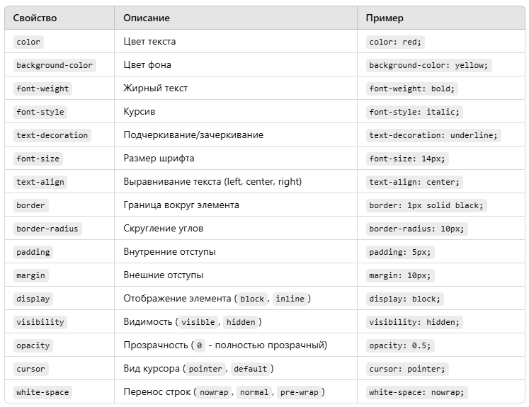

<xpath expr="//field[@name='milestone_id']" position="after">
     <field name="assignee_id" style="color: green;"/>
</xpath>

Свойство	Описание	Пример
color	Цвет текста	color: red;
background-color	Цвет фона	background-color: yellow;
font-weight	Жирный текст	font-weight: bold;
font-style	Курсив	font-style: italic;
text-decoration	Подчеркивание/зачеркивание	text-decoration: underline;
font-size	Размер шрифта	font-size: 14px;
text-align	Выравнивание текста (left, center, right)	text-align: center;
border	Граница вокруг элемента	border: 1px solid black;
border-radius	Скругление углов	border-radius: 10px;
padding	Внутренние отступы	padding: 5px;
margin	Внешние отступы	margin: 10px;
display	Отображение элемента (block, inline)	display: block;
visibility	Видимость (visible, hidden)	visibility: hidden;
opacity	Прозрачность (0 - полностью прозрачный)	opacity: 0.5;
cursor	Вид курсора (pointer, default)	cursor: pointer;
white-space	Перенос строк (nowrap, normal, pre-wrap)	white-space: nowrap;

📌 1️⃣ Названия цветов (140 стандартных имен)
https://developer.mozilla.org/en-US/docs/Web/CSS/named-color

CSS поддерживает 140 именованных цветов. Вот основные:

🔴 Красные оттенки:

red

darkred

firebrick

crimson

indianred

🟠 Оранжевые оттенки:

orange

darkorange

coral

tomato

🟡 Желтые оттенки:

yellow

gold

khaki

lightyellow

🟢 Зеленые оттенки:

green

darkgreen

lime

seagreen

springgreen

🔵 Синие оттенки:

blue

darkblue

royalblue

dodgerblue

skyblue

🟣 Фиолетовые оттенки:

purple

indigo

violet

plum

orchid

⚪ Оттенки серого:

black

gray

darkgray

lightgray

white

Полный список всех 140 именованных цветов:
👉 MDN Web Docs - Named Colors