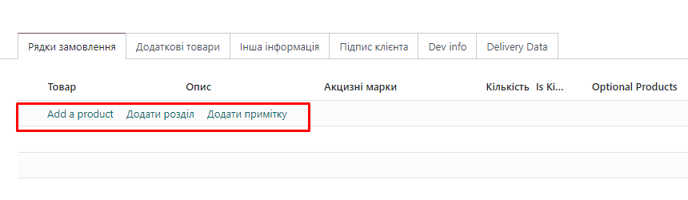

control
================================

    <field name="order_line" widget="section_and_note_one2many" mode="tree,kanban" attrs="{'readonly': [('state', 'in', ('done','cancel'))]}">
         <tree string="Sales Order Lines" editable="bottom">
                    <control>
                        <create name="add_product_control" string="Add a product"/>
                        <create name="add_section_control" string="Add a section" context="{'default_display_type': 'line_section'}"/>
                        <create name="add_note_control" string="Add a note" context="{'default_display_type': 'line_note'}"/>
                    </control>

В Odoo, элемент <control> используется для настройки различных аспектов поведения интерфейса, таких как создание,
удаление или копирование записей в списковом представлении (tree view). Он позволяет добавлять дополнительные кнопки и
действия, которые могут быть выполнены пользователем.

Пример использования <control> в списковом представлении
Давайте рассмотрим пример использования <control> в списковом представлении Sales Order Lines.

Пример XML кода
xml
Копировать код
<tree string="Sales Order Lines" editable="bottom">
<control>
<create name="add_product_control" string="Add a product"/>
<create name="add_section_control" string="Add a section" context="{'default_display_type': 'line_section'}"/>
<create name="add_note_control" string="Add a note" context="{'default_display_type': 'line_note'}"/>
</control>
<field name="product_id"/>
<field name="product_uom_qty"/>
<field name="price_unit"/>
</tree>
Пояснение
<tree>: Определяет списковое представление для отображения записей. Атрибут editable="bottom" позволяет редактировать
записи внизу списка.

<control>: Этот элемент используется для добавления кнопок и действий в списковое представление. Он может содержать
несколько подэлементов, таких как <create>, <delete>, <copy>, и другие.

<create>: Используется для добавления кнопки "Создать" с определенным поведением. В этом примере добавлены три разных
кнопки "Создать":

<create name="add_product_control" string="Add a product"/>: Добавляет кнопку "Add a product", которая позволяет
пользователю добавлять новую строку для продукта.
<create name="add_section_control" string="Add a section" context="{'default_display_type': 'line_section'}"/>:
Добавляет кнопку "Add a section", которая создает новую строку с определенным контекстом, устанавливающим display_type
как line_section.
<create name="add_note_control" string="Add a note" context="{'default_display_type': 'line_note'}"/>: Добавляет
кнопку "Add a note", которая создает новую строку с контекстом, устанавливающим display_type как line_note.
Как это работает
Кнопка "Add a product": При нажатии этой кнопки будет добавлена новая строка в списковое представление, где пользователь
может выбрать продукт и заполнить соответствующие поля.
Кнопка "Add a section": При нажатии этой кнопки будет добавлена новая строка с display_type равным line_section. Это
может быть полезно для организации записей в секции.
Кнопка "Add a note": При нажатии этой кнопки будет добавлена новая строка с display_type равным line_note, что позволяет
добавлять заметки в списковое представление.
Пример полного модуля
Структура модуля
markdown
Копировать код
custom_sale_order/
├── __init__.py
├── __manifest__.py
├── views/
│ ├── sale_order_views.xml
__manifest__.py
python
Копировать код
{
'name': 'Custom Sale Order',
'version': '1.0',
'category': 'Sales',
'summary': 'Custom Sale Order with additional control buttons',
'description': """
This module customizes the Sale Order to add additional control buttons for adding products, sections, and notes.
""',
'author': 'Your Name',
'depends': ['sale'],
'data': [
'views/sale_order_views.xml',
],
'installable': True,
'auto_install': False,
}
views/sale_order_views.xml
xml
Копировать код
<odoo>
<record id="view_order_form" model="ir.ui.view">
<field name="name">sale.order.form</field>
<field name="model">sale.order</field>
<field name="arch" type="xml">
<form string="Sales Order">
<sheet>
<group>
<field name="partner_id"/>
<field name="order_line">
<tree string="Sales Order Lines" editable="bottom">
<control>
<create name="add_product_control" string="Add a product"/>
<create name="add_section_control" string="Add a section" context="{'default_display_type': 'line_section'}"/>
<create name="add_note_control" string="Add a note" context="{'default_display_type': 'line_note'}"/>
</control>
<field name="product_id"/>
<field name="product_uom_qty"/>
<field name="price_unit"/>
</tree>
</field>
</group>
</sheet>
</form>
</field>
</record>
</odoo>
Заключение
Элемент <control> позволяет добавлять дополнительные кнопки и действия в списковом представлении Odoo. Используя
подэлементы <create>, можно добавлять различные кнопки для создания записей с заданными параметрами, что улучшает
пользовательский интерфейс и упрощает выполнение частых задач.