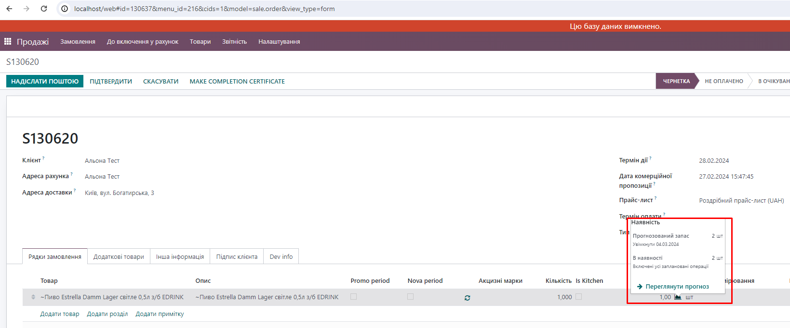

    <field name="qty_delivered" decoration-info="(not display_type and invoice_status == 'to invoice')" 
decoration-bf="(not display_type and invoice_status == 'to invoice')" 
        string="Доставлено" 
optional="show" 
on_change="1" 
modifiers="{&quot;readonly&quot;: [[&quot;qty_delivered_method&quot;, &quot;!=&quot;, &quot;manual&quot;]], &quot;column_invisible&quot;: [[&quot;parent.state&quot;, &quot;not in&quot;, [&quot;sale&quot;, &quot;done&quot;]]]}"/>
                    <!-- below fields are used in the widget qty_at_date_widget -->
        
                    <field name="virtual_available_at_date" modifiers="{&quot;readonly&quot;: true, &quot;column_invisible&quot;: true}"/>
                    <field name="qty_available_today" modifiers="{&quot;readonly&quot;: true, &quot;column_invisible&quot;: true}"/>
                    <field name="free_qty_today" modifiers="{&quot;readonly&quot;: true, &quot;column_invisible&quot;: true}"/>
                    <field name="scheduled_date" modifiers="{&quot;readonly&quot;: true, &quot;column_invisible&quot;: true}"/>
                    <field name="forecast_expected_date" modifiers="{&quot;readonly&quot;: true, &quot;column_invisible&quot;: true}"/>
                    <field name="warehouse_id" modifiers="{&quot;readonly&quot;: true, &quot;column_invisible&quot;: true}"/>
                    <field name="move_ids" on_change="1" modifiers="{&quot;column_invisible&quot;: true}"/>
                    <field name="qty_to_deliver" modifiers="{&quot;readonly&quot;: true, &quot;column_invisible&quot;: true}"/>
                    <field name="is_mto" modifiers="{&quot;readonly&quot;: true, &quot;column_invisible&quot;: true}"/>
                    <field name="display_qty_widget" modifiers="{&quot;readonly&quot;: true, &quot;column_invisible&quot;: true}"/>
                    <widget name="qty_at_date_widget" width="20px"/>

