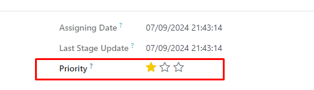

звезды widget="priority"
===========================
    priority = fields.Selection([
        ('0', 'Low'),
        ('1', 'High'),
        ('2', 'Very High'),
        ('3', 'Critical')]
                                )

# form

    <form>
        <xpath expr="//field[@name='date_last_stage_update']" position="after">
            <field name="priority" widget="priority_switch"/>
        </xpath>
    </form>

# tree
    
    <tree>
        <field name="priority" widget="priority" nolabel="1"/>
    </tree>

# kanban
    <kanban> 
        

            

                <field name="priority" widget="priority" style="margin-right: 5px;" field_id="priority_1"/>
    </kanban> 
