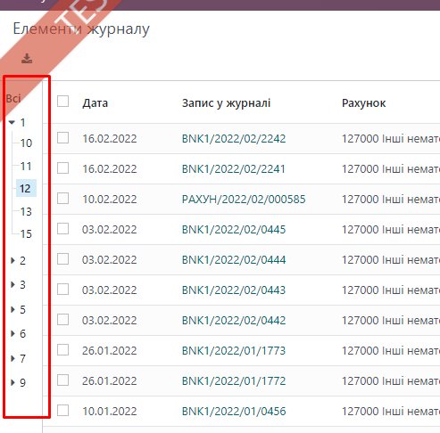

Search Panel (поисковая панель) - это функциональность в системе Odoo, которая предоставляет пользователю удобный способ
выполнения расширенных поисковых запросов для фильтрации записей в представлениях (например, списках) моделей. Она
позволяет пользователям быстро находить нужные данные, применяя различные фильтры и критерии поиска.

Вот некоторые ключевые аспекты поисковой панели в Odoo:

Фильтры и фильтр-полосы: Поисковая панель включает в себя различные фильтры, которые пользователь может использовать для
уточнения результатов поиска. Эти фильтры обычно отображаются в виде полос над списком записей.

Динамический поиск: Пользователи могут добавлять и удалять фильтры динамически, позволяя создавать сложные запросы для
поиска данных.

Фильтры по различным полям: Поисковая панель может содержать фильтры по различным полям модели, таким как текстовые,
числовые, дата/время и другие.

Логические операторы: В некоторых случаях пользователи могут использовать логические операторы (и, или, не) для создания
сложных комбинированных фильтров.

Сохраненные фильтры: Пользователи могут сохранять настроенные фильтры для повторного использования в будущем.

Продвинутый поиск: Search Panel может поддерживать продвинутые функции, такие как поиск с использованием регулярных
выражений или поиск по диапазонам значений.

Удобство использования: Основная идея Search Panel - обеспечить простой и интуитивно понятный интерфейс для
пользователей, чтобы они могли быстро находить нужные данные.

Search Panel может быть настроен и адаптирован под конкретные требования вашего бизнес-процесса или модели данных. Это
мощный инструмент для повышения производительности и удобства работы с данными в системе Odoo.

    <search string="Search Journal Items">
       <searchpanel class="account_root">
          <field name="account_root_id" icon="fa-filter" groupby="account_id" limit="0"/>
       </searchpanel>
    </search>

