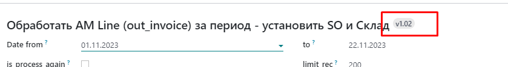

# badge - значок
==========================================================

    <field name="version_id" widget="badge"/>
    
    <h2>Обработать АМ Line (out_invoice) за период - установить SO и Склад <field name="version_id" widget="badge"/></h2>

