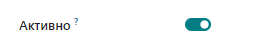

# widget="boolean_toggle":  - вид переключателя
 ==========================================================
    <field name="active" widget="boolean_toggle"/>

 

# widget="boolean":  - как флажок.
 ==========================================================
    <field name="active" widget="boolean"/>
