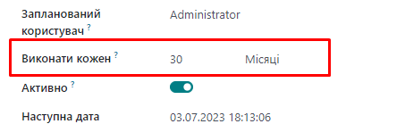

поля в одну строку
=====================================================

    <label for="interval_number" string="Виконати кожен"/>
    

       <field name="interval_number" class="oe_inline"/>
       <field name="interval_type" class="oe_inline"/>
    

поля в одну строку с текстом
=====================================================

        <label for="current_value_svl" string="Current Value"/>
        

            
            <field name="current_value_svl" class="oe_inline" widget="monetary"/> for <field name="current_quantity_svl" class="oe_inline"/> <field name="product_uom_name" class="oe_inline"/>
            
        

        <label for="added_value" string="Added Value"/>
        

            <field name="added_value" class="oe_inline"/> = <field name="new_value" class="oe_inline"/> (<field name="new_value_by_qty" class="oe_inline ms-1"/> by <field name="product_uom_name" class="oe_inline me-1"/>)
            <small class="mx-2 fst-italic">Use a negative added value to record a decrease in the product value</small>
        

поля в одну строку с текстом и картинкой
=====================================================

        <group col="2">
            <group>
                <label for="novinka_period_start" string="novinka_period"/>
                

                    
                        <field name="novinka_period_start" class="oe_inline"/> -
                        <field name="novinka_period_start" class="oe_inline"/>
                        <button name="button_set_novinka_period"
                                icon="fa-refresh"
                                title="Set nova_period flags"
                                type="object"/>
                    
                

            </group>

            <group>
                <field name="create_date" class="oe_inline"/>
            </group>
        </group>

поля в одну строку с текстом и картинкой
=====================================================

если кнопку выводить перед полем, то выводимое поле НЕ куцое
(не уменьшается в размере относительно других полей в группе)
и class="oe_inline" - НЕ ставить (иначе поле скукожится)

        <group>
            <field name="name"/>

            

                <label for="py_target_class" class="fw-bold"/>
                <button name="action_generate_py_target_class"
                        type="object"
                        icon="fa-magic"
                        class="oe_link"
                        title="Generate class name"/>

                <field name="py_target_class" placeholder="Auto"/>
            

            <field name="module_id"/>

        </group>