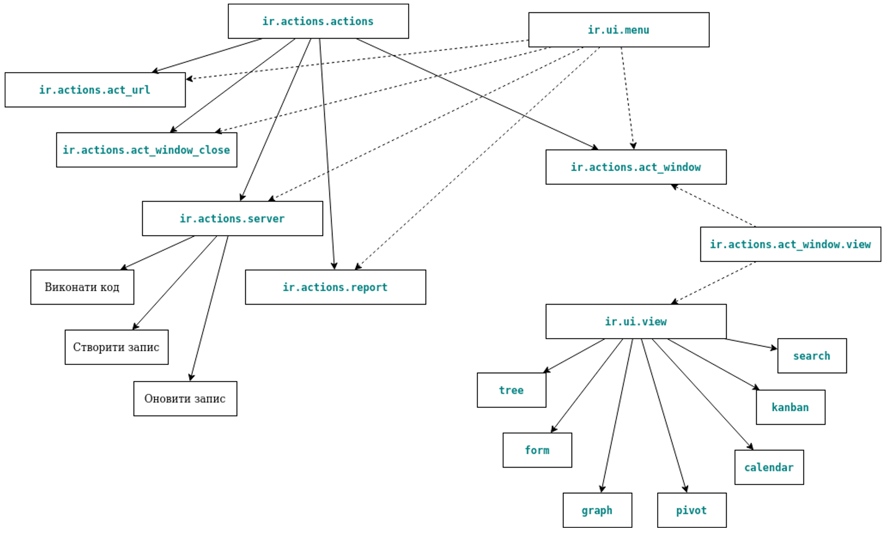

1. Загальна архітектура

Загальна архітектура візуального представлення складається з дій (actions), меню (menus) та представлень (views). Меню
посилаються на дії, які будуть виконані, а модель ir.actions.act_window.view забезпечує зв’язок між діями та
представленнями.
