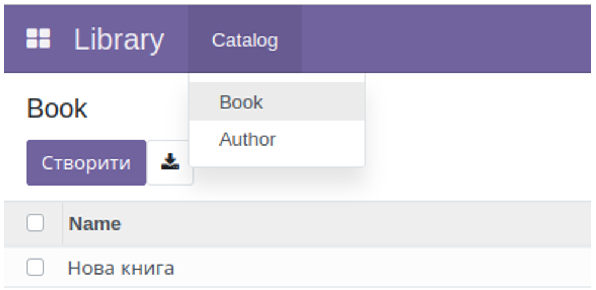

3. Меню
   Меню є записами в моделі ir.ui.menu. Це є ієрархічна модель. Меню верхнього рівня виглядають як модулі і знаходяться
   у головному меню

Усі підпорядковані йому меню складають меню модуля

Розглянем код

<menuitem id="kw_lib_main_menu"
         web_icon="kw_lib,static/description/icon.png"
         name="Library" sequence="300"/>

<menuitem id="kw_lib_catalog_menu"
         parent="kw_lib_main_menu"
         name="Catalog" sequence="100"/>

<menuitem id="kw_lib_settings_main_menu"
         parent="kw_lib_main_menu"
         name="Settings" sequence="9999"/>

Головне меню kw_lib_main_menu не має атрибуту parent і тому є головним. Інші меню містять ID головного меню в атрибуті
parent.

Важливо! Немає зв’язку між модулем і головним меню. В модулі може бути декілька головних меню або не бути взагалі.

Атрибут sequence визначає порядок, в якому буде відображатись меню.

Атрибут web_icon визначає іконку, яка буде відображатись меню в ЕЕ версії або при встановленому модулі web_responsive.

<record id="kw_lib_author_act_window" model="ir.actions.act_window">
   <field name="name">Author</field>
   <field name="type">ir.actions.act_window</field>
   <field name="res_model">kw.lib.author</field>
   <field name="view_mode">tree,form</field>
</record>

   <menuitem id="kw_lib_author_menu"
            action="kw_lib_author_act_window"
            parent="kw_lib_catalog_menu"
            name="Author" sequence="200"/>

Меню нижнього рівня мають мати атрибут action, який містить ID дії, яка буде виконуватись при виборі цього меню.

Важливо! Будь який елемент має бути визначений до його використання, тому батьківське меню та дія мають бути визначені
перед використанням в меню

