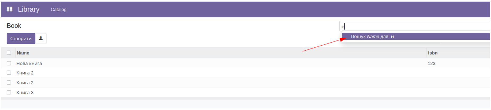

1. Загальний вигляд представлення

    <record id="kw_lib_book_search" model="ir.ui.view">
       <field name="name">kw.lib.book.search (kw_library)</field>
       <field name="model">kw.lib.book</field>
       <field name="arch" type="xml">
           <search>
               <field name="name"/>
           </search>
       </field>
    </record>

Для створення представлення пошуку створюється запис в моделі ir.ui.view для потрібної моделі та в поле arch додається
xml опис даного представлення. Весь контент має бути огорнутий у тег search, а в ньому іде опис полів, фільтрів,
групувань, пошукова панель.

