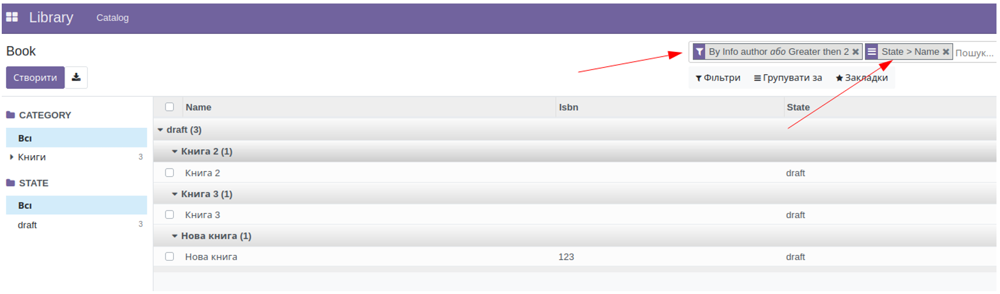

11. Фільтрація за замовчуванням
======================================

       <record id="kw_lib_book_act_window" model="ir.actions.act_window">
           <field name="name">Book</field>
           <field name="type">ir.actions.act_window</field>
           <field name="res_model">kw.lib.book</field>
           <field name="view_mode">tree,form,pivot,graph</field>
           <field name="context">{
     'search_default_author_info': 2,
     'search_default_groupby_name': 2,
     'search_default_qty_gt_2': 3,
     'search_default_groupby_state': 1,
    }</field>
       </record>

Для кожної дії можна прописати фільтри за замовчуванням, в словник поля context треба додати ключі, що починаються з
search_default_ і імені фільтра. Це можуть бути як фільтри для вибірки, так і фільтри для групування, значення задає
порядок, в якому фільтри будуть застосовуватись.

 
