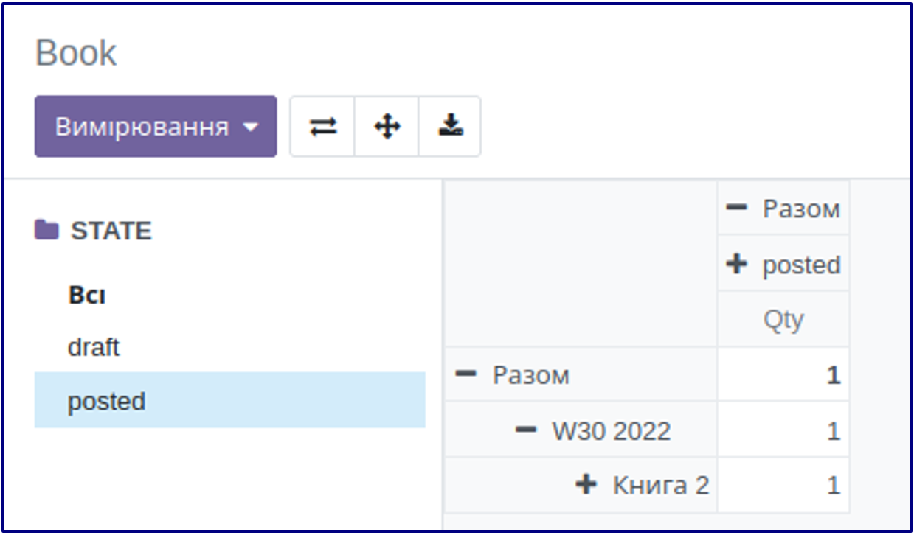

7. Панель пошуку

<record id="kw_lib_book_search" model="ir.ui.view">
   <field name="name">kw.lib.book.search (kw_library)</field>
   <field name="model">kw.lib.book</field>
   <field name="arch" type="xml">
       <search>
           <searchpanel view_types="tree,pivot">
               <field name="state"/>
           </searchpanel>
       </search>
   </field>
</record>

Панель пошуку - швидкий інструмент для фільтрації даних, створюється за допомогою тегу searchpanel і доступний для
представлень з багатьма записами, такими як список, канбан тощо і відповідно недоступний для форми і аналогічних
представлень. За замовчанням відкритий для представлень список та канбан, 
але може бути відкритим до інших представлень
за допомогою атрибута view_types, де через кому перелічуються потрібні представлення.

