# Загальний вигляд

\<**record id=\"kw_lib_author_tree\" model=\"ir.ui.view\"**\>

[]{.mark}\<**field name=\"name\"**\>[kw.lib.author.tree
(kw_library)]{.mark}\</**field**\>

[]{.mark}\<**field
name=\"model\"**\>[kw.lib.author]{.mark}\</**field**\>

[]{.mark}\<**field name=\"arch\" type=\"xml\"**\>

[]{.mark}\<**tree default_order=\"sequence\"**\>

[]{.mark}\<**field name=\"sequence\" widget=\"handle\"**/\>

[]{.mark}\<**field name=\"name\" optional=\"show\"**/\>

[]{.mark}\<**field name=\"name1\" optional=\"hide\"**/\>

[]{.mark}\<**field name=\"state\" optional=\"show\"** /\>

[]{.mark}\<**button icon=\"fa-ticket\" name=\"create\"
attrs=\"{\'invisible\': \[(\'state\',\'in\',\[\'posted\',
False,\'draft\'\])\]}\"**/\>

[]{.mark}\</**tree**\>

[]{.mark}\</**field**\>

\</**record**\>

Для створення представлення списком створюється запис в моделі
***ir.ui.view*** для потрібної моделі та в поле ***arch*** додається
***xml*** опис даного представлення. Весь контент має бути огорнутий у
тег ***tree***, а в ньому іде опис полів або кнопок, що будуть
відображені на даному представлені. Особливості відображення конкретного
представлення виконуються за допомогою додавання атрибутів у тег
***tree*** та теги полів та кнопок

# Підсвічування

[]{.mark}\<**tree decoration-bf=\"bool1==True\"**

**decoration-muted=\"bool2==True\"**

**decoration-info=\"bool3==True\"**

**decoration-danger=\"bool4==True\"**

**decoration-warning=\"bool5==True\"**

**decoration-success=\"bool6==True\"**\>

[]{.mark}\<**field name=\"name\"**/\>

[]{.mark}\<**field name=\"name1\"**/\>

[]{.mark}\<**field name=\"bool1\"**/\>

[]{.mark}\<**field name=\"bool2\"**/\>

[]{.mark}\<**field name=\"bool3\"**/\>

[]{.mark}\<**field name=\"bool4\"**/\>

[]{.mark}\<**field name=\"bool5\"**/\>

[]{.mark}\<**field name=\"bool6\"**/\>

[]{.mark}\</**tree**\>

Підсвічування може змінити колір та жирність тексту в перегляді списком.
Доступні наступні види підсвічування: BF, muted, info, danger, warning,
success

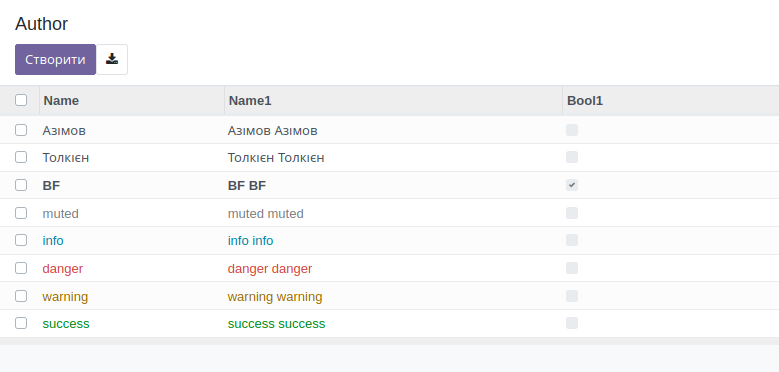{width="7.086614173228346in"
height="3.388888888888889in"}

Підсвічування можна розповсюджувати не на весь рядок, а лише на окреме
поле

\<**tree**\>

[]{.mark}\<**field name=\"name\"**/\>

[]{.mark}\<**field name=\"name1\" decoration-bf=\"bool1==True\"**

**decoration-muted=\"bool2==True\"**

**decoration-info=\"bool3==True\"**

**decoration-danger=\"bool4==True\"**

**decoration-warning=\"bool5==True\"**

**decoration-success=\"bool6==True\"**/\>

[]{.mark}\<**field name=\"bool1\"**/\>

[]{.mark}\<**field name=\"bool2\"**/\>

[]{.mark}\<**field name=\"bool3\"**/\>

[]{.mark}\<**field name=\"bool4\"**/\>

[]{.mark}\<**field name=\"bool5\"**/\>

[]{.mark}\<**field name=\"bool6\"**/\>

\</**tree**\>

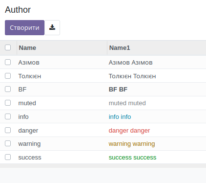{width="4.395833333333333in"
height="3.8958333333333335in"}

# Не створювати

\<**tree create=\"false\"**\>

[]{.mark}\<**field name=\"name\"**/\>

[]{.mark}\<**field name=\"name1\"**/\>

[]{.mark}\<**field name=\"state\" widget=\"badge\"**

**decoration-success=\"state == \'posted\'\"**

**decoration-info=\"state == \'draft\'\"**/\>

\</**tree**\>

Атрибут ***create*** визначає чи буде відображатись кнопка Створити. Зв
замовчуванню кнопка відображається

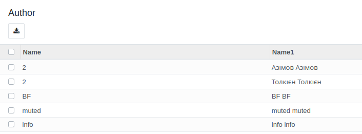{width="7.086614173228346in" height="2.625in"}

# Розгортання

\<**tree expand=\"1\"**\>

[]{.mark}\<**field name=\"name\"**/\>

[]{.mark}\<**field name=\"name1\"**/\>

[]{.mark}\<**field name=\"state\" widget=\"badge\"**

**decoration-success=\"state == \'posted\'\"**

**decoration-info=\"state == \'draft\'\"**/\>

\</**tree**\>

Атрибут ***expand*** визначає чи будуть групи розгорнуті при групуванні.
За замовчанням згорнуті.

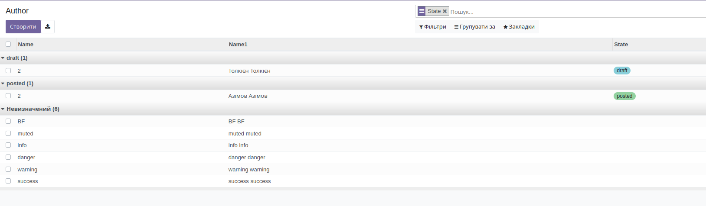{width="7.086614173228346in"
height="2.0694444444444446in"}

# Редагування у списку

\<**tree editable=\"top\"**\>

[]{.mark}\<**field name=\"name\"**/\>

[]{.mark}\<**field name=\"name1\"**/\>

[]{.mark}\<**field name=\"state\" widget=\"badge\"**

**decoration-success=\"state == \'posted\'\"**

**decoration-info=\"state == \'draft\'\"**/\>

\</**tree**\>

Атрибут ***editable*** надає можливість редагувати значення у списку, а
також додавати нові записи (крім випадків, коли ***create="False"*** )
новий запис з'явиться відповідно до значення атрибуту ***top*** - вгори,
***bottom*** - наприкінці

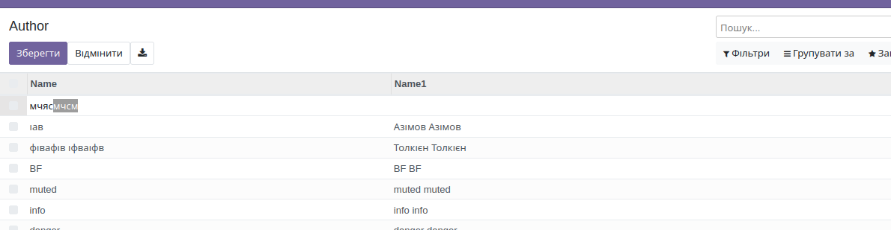{width="7.086614173228346in"
height="1.8333333333333333in"}

# Множине редагування 

\<**tree multi_edit=\"1\"**\>

[]{.mark}\<**field name=\"name\"**/\>

[]{.mark}\<**field name=\"name1\"**/\>

[]{.mark}\<**field name=\"state\"**/\>

\</**tree**\>

Атрибут ***multy_edit*** надає можливість змінити значення декільком
записам, які обрані (відмічені галочкою). Усім записам буде прописано
однакове значення.

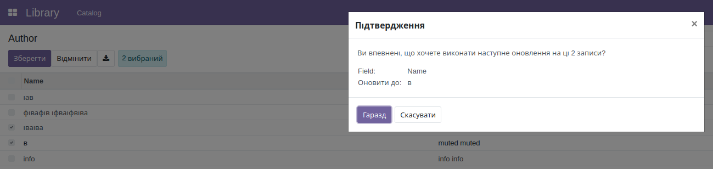{width="7.086614173228346in"
height="1.6805555555555556in"}

# Опціональне відображення полів

\<**tree**\>

[]{.mark}\<**field name=\"name\" optional=\"show\"**/\>

[]{.mark}\<**field name=\"name1\" optional=\"hide\"**/\>

[]{.mark}\<**field name=\"state\" optional=\"show\"**/\>

\</**tree**\>

Прописаний для поля атрибут ***optional*** надає користувачу можливість
відображати або приховувати поле у списку. Змінювати режим відображення
користувач може лише полям з даним атрибутом. Якщо хоча б одне поле має
цей атрибут, у списку з\'явиться віджет у вигляді 3х крабочек, який
розкриє меню для вибору стану відображення поля. Значення атрибуту буде
поведінкою поля за замовчуванням (потім буде братись визначене
користувачем). Значення ***show*** буде відображати поле, а ***hide***
відповідно приховувати.

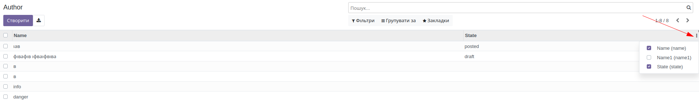{width="7.086614173228346in"
height="1.0277777777777777in"}

# Зміна порядку сортування

\<**tree default_order=\"name\"**\>

[]{.mark}\<**field name=\"name\" optional=\"show\"**/\>

[]{.mark}\<**field name=\"name1\" optional=\"hide\"**/\>

[]{.mark}\<**field name=\"state\" optional=\"show\"**/\>

\</**tree**\>

Атрибут ***default_order*** надає можливість змінити сортування значень

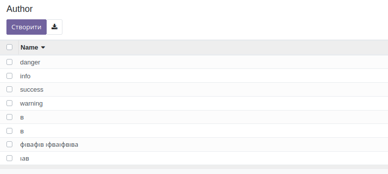{width="7.086614173228346in"
height="3.1805555555555554in"}

# Віджет handle

\<**tree default_order=\"sequence\"**\>

[]{.mark}\<**field name=\"sequence\" widget=\"handle\"**/\>

[]{.mark}\<**field name=\"name\" optional=\"show\"**/\>

[]{.mark}\<**field name=\"name1\" optional=\"hide\"**/\>

[]{.mark}\<**field name=\"state\" optional=\"show\"**/\>

\</**tree**\>

Призначений полю віджет ***handle*** надає можливість переставляти
записи перетягуванням, змінюючи їх порядок

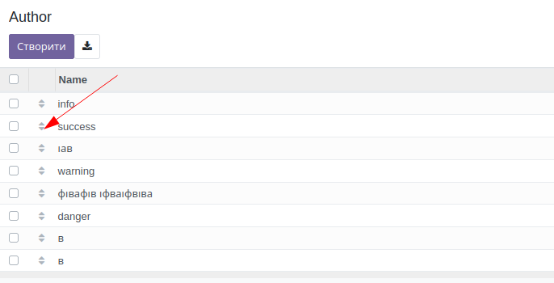{width="7.086614173228346in"
height="3.611111111111111in"}

# Використання кнопок на списку

\<**tree default_order=\"sequence\"**\>

[]{.mark}\<**field name=\"sequence\" widget=\"handle\"**/\>

[]{.mark}\<**field name=\"name\" optional=\"show\"**/\>

[]{.mark}\<**field name=\"name1\" optional=\"hide\"**/\>

[]{.mark}\<**field name=\"state\" optional=\"show\"** /\>

[]{.mark}\<**button string=\"New button\" name=\"create\"
attrs=\"{\'invisible\': \[(\'state\',\'=\',\'posted\')\]}\"**/\>

\</**tree**\>

У перегляді списком можна використовувати кнопки, вони будуть
відображатись у стовпчиках аналогічно полям

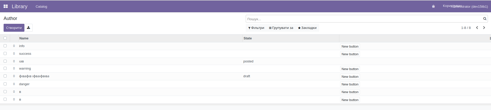{width="7.086614173228346in"
height="1.5972222222222223in"}

\<**tree default_order=\"sequence\"**\>

[]{.mark}\<**field name=\"sequence\" widget=\"handle\"**/\>

[]{.mark}\<**field name=\"name\" optional=\"show\"**/\>

[]{.mark}\<**field name=\"name1\" optional=\"hide\"**/\>

[]{.mark}\<**field name=\"state\" optional=\"show\"** /\>

[]{.mark}\<**button icon=\"fa-ticket\" name=\"create\"
attrs=\"{\'invisible\': \[(\'state\',\'=\',\'posted\')\]}\"**/\>

\</**tree**\>

Кнопка може використовувати іконку, що дозволяє економити місце

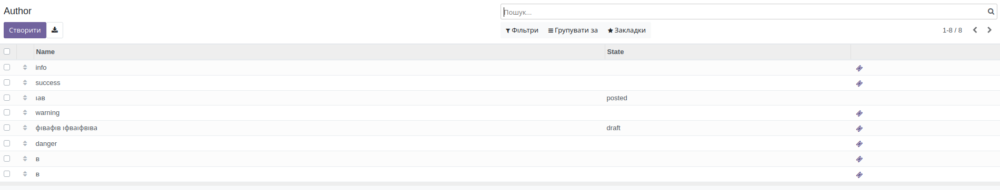{width="7.086614173228346in"
height="1.3472222222222223in"}

# Використання приховування

\<**tree default_order=\"sequence\"**\>

[]{.mark}\<**field name=\"sequence\" widget=\"handle\"**/\>

[]{.mark}\<**field name=\"name\" optional=\"show\"**/\>

[]{.mark}\<**field name=\"name1\" optional=\"hide\"**/\>

[]{.mark}\<**field name=\"state\" optional=\"show\"** /\>

[]{.mark}\<**button icon=\"fa-ticket\" name=\"create\"
attrs=\"{\'invisible\': \[(\'state\',\'=\',\'posted\')\]}\"**/\>

\</**tree**\>

При використанні приховування елемент (поле або кнопка) будуть
приховані, але стовпчик залишеться, навіть, якщо всі значення будуть
приховані

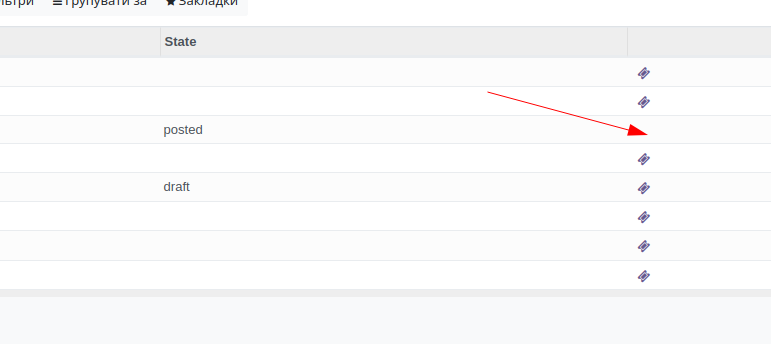{width="7.086614173228346in"
height="3.1666666666666665in"}
