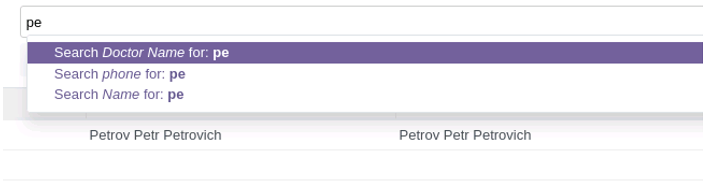

2. Пошук по полю (field)
   Порядок полів для пошуку в стандартному поле search

<record id="kw_lib_book_search" model="ir.ui.view">
   <field name="name">kw.lib.book.search (kw_library)</field>
   <field name="model">kw.lib.book</field>
   <field name="arch" type="xml">
       <search>
           <field name="name" filter_domain="['|',('state','ilike',self),('name','ilike',self)]"/>
           <field name="qty" operator=">"/>
           <field name="state"/>
           <field name="author_ids" domain="[('name','ilike','info')]"/>
       </search>
   </field>
</record>

Пошук по полю автоматично запускається, коли користувач починає набирати в елементі пошуку, пропозиції пошуку будуть
відображатись у порядку, визначеному в xml.

Важливо! Якщо явно не вказаний атрибут operator чи filter_domain, для числових полів буде використовуватись оператор
рівності, що еквівалентно

[('qty','=',self)]

а строковим полям буде

[('name','ilike',self)]

Атрибут operator дозволяє змінити цю поведінку, поставити оператор більше для числових полів, рівність для строкових
тощо.

Атрибут filter_domain дозволяє створити складний домен, що може включати декілька полів та складні умови.

Важливо! Для цього домену значення пошуку містить зміна self

Атрибут domain працює для полів, що мають вибір (Many2one, Many2many тощо). Такий домен може використовувати контекстні
змінні, такі як uid.
