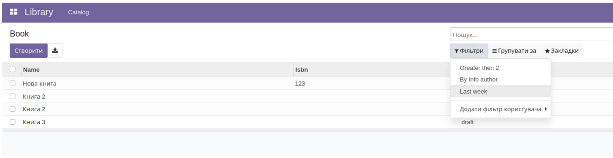

3. Встановлений фільтр (filter)
   Використувуеться filter а не field

<record id="kw_lib_book_search" model="ir.ui.view">
   <field name="name">kw.lib.book.search (kw_library)</field>
   <field name="model">kw.lib.book</field>
   <field name="arch" type="xml">
       <search>
           <filter name="qty_gt_2" string="Greater then 2" domain="[('qty','>',2)]"/>
           <filter name="author_info" string="By Info author" domain="[('author_ids.name','ilike','info')]"/>
           <filter name="created_last_week" string="Last week" domain="[('create_date', '&gt;', (context_today() - relativedelta(weeks=1)).strftime('%Y-%m-%d') )]"/>
       </search>
   </field>
</record>

Фільтр, на відміну від поля, не використовує введене значення, а використовує попередньо встановлені умови. Для цього є
атрибут domain, який може використовувати контекстні змінні та функції, наприклад функції роботи з датою context_today
або relativedelta.

