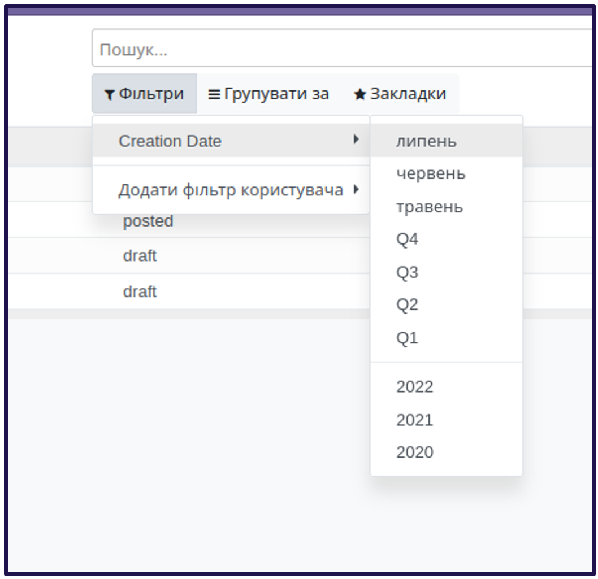

4. Специфіка для дат

<record id="kw_lib_book_search" model="ir.ui.view">
   <field name="name">kw.lib.book.search (kw_library)</field>
   <field name="model">kw.lib.book</field>
   <field name="arch" type="xml">
       <search>
           <filter name="filter_create_date" date="create_date" string="Creation Date"/>
       </search>
   </field>
</record>

Поля типу Date або Datetime без вказаного домену мають специфічний фільтр, який дозволяє обрати один з трьох найближчих
місяціі, кварталів, років.

