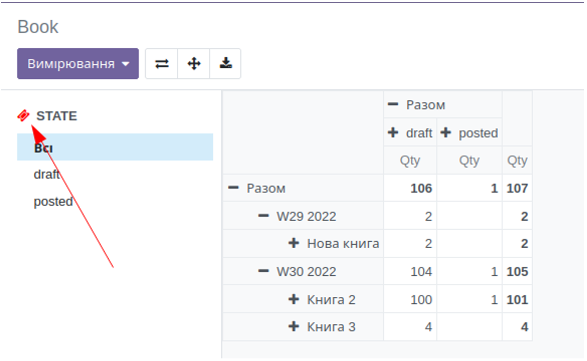

8. Іконка

<record id="kw_lib_book_search" model="ir.ui.view">
   <field name="name">kw.lib.book.search (kw_library)</field>
   <field name="model">kw.lib.book</field>
   <field name="arch" type="xml">
       <search>
           <searchpanel view_types="tree,pivot">
               <field name="state" icon="fa-ticket" color="red"/>
           </searchpanel>
       </search>
   </field>
</record>

Атрибут icon для тегу поля дозволяє замінити іконку за замовчанням, а атрибут color замінити її колір.

