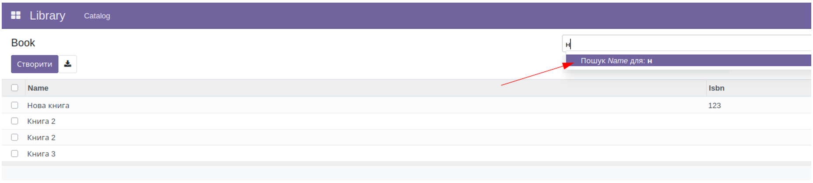
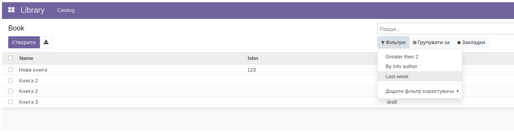
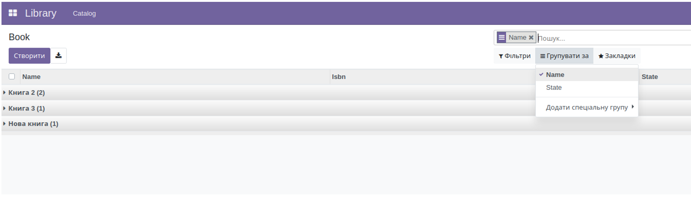
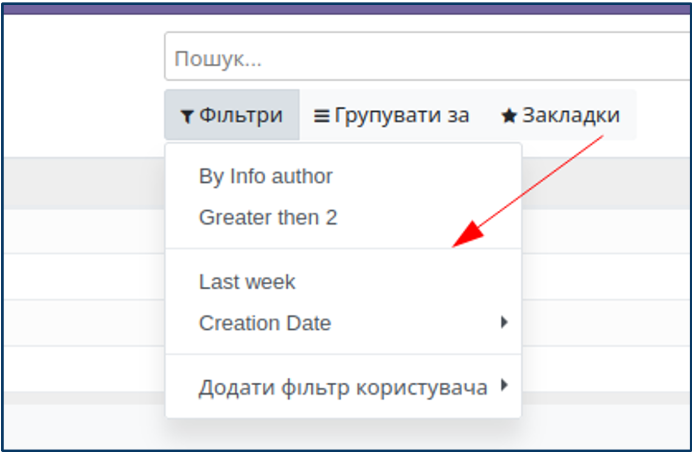
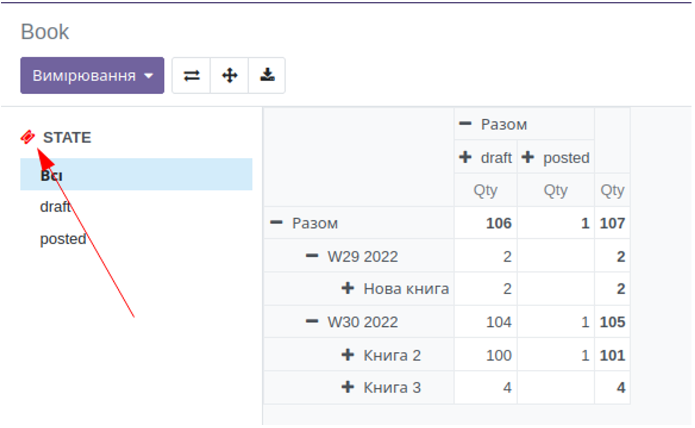
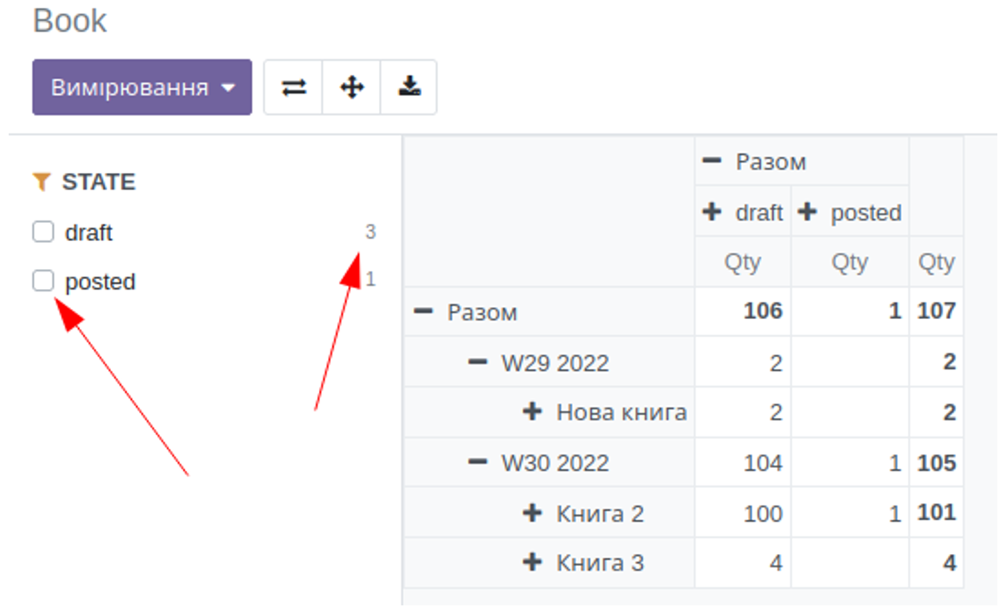
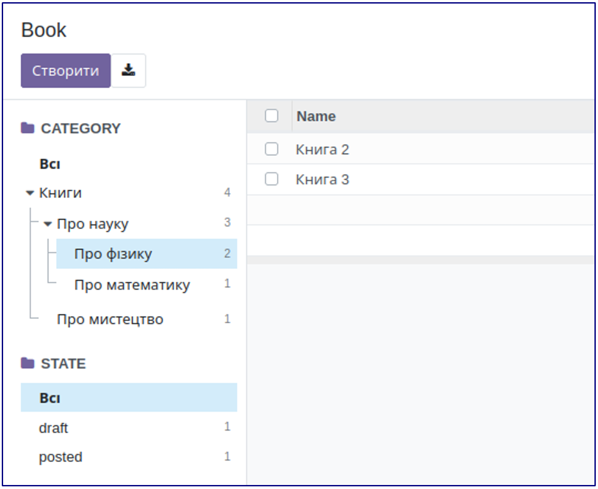

1. Загальний вигляд представлення

    <record id="kw_lib_book_search" model="ir.ui.view">
       <field name="name">kw.lib.book.search (kw_library)</field>
       <field name="model">kw.lib.book</field>
       <field name="arch" type="xml">
           <search>
               <field name="name"/>
           </search>
       </field>
    </record>

Для створення представлення пошуку створюється запис в моделі ir.ui.view для потрібної моделі та в поле arch додається
xml опис даного представлення. Весь контент має бути огорнутий у тег search, а в ньому іде опис полів, фільтрів,
групувань, пошукова панель.

2. Пошук по полю (field)
   Порядок полів для пошуку в стандартному поле search

<record id="kw_lib_book_search" model="ir.ui.view">
   <field name="name">kw.lib.book.search (kw_library)</field>
   <field name="model">kw.lib.book</field>
   <field name="arch" type="xml">
       <search>
           <field name="name" filter_domain="['|',('state','ilike',self),('name','ilike',self)]"/>
           <field name="qty" operator=">"/>
           <field name="state"/>
           <field name="author_ids" domain="[('name','ilike','info')]"/>
       </search>
   </field>
</record>

Пошук по полю автоматично запускається, коли користувач починає набирати в елементі пошуку, пропозиції пошуку будуть
відображатись у порядку, визначеному в xml.

Важливо! Якщо явно не вказаний атрибут operator чи filter_domain, для числових полів буде використовуватись оператор
рівності, що еквівалентно

[('qty','=',self)]

а строковим полям буде

[('name','ilike',self)]

Атрибут operator дозволяє змінити цю поведінку, поставити оператор більше для числових полів, рівність для строкових
тощо.

Атрибут filter_domain дозволяє створити складний домен, що може включати декілька полів та складні умови.

Важливо! Для цього домену значення пошуку містить зміна self

Атрибут domain працює для полів, що мають вибір (Many2one, Many2many тощо). Такий домен може використовувати контекстні
змінні, такі як uid.

3. Встановлений фільтр (filter)
   Використувуеться filter а не field

<record id="kw_lib_book_search" model="ir.ui.view">
   <field name="name">kw.lib.book.search (kw_library)</field>
   <field name="model">kw.lib.book</field>
   <field name="arch" type="xml">
       <search>
           <filter name="qty_gt_2" string="Greater then 2" domain="[('qty','>',2)]"/>
           <filter name="author_info" string="By Info author" domain="[('author_ids.name','ilike','info')]"/>
           <filter name="created_last_week" string="Last week" domain="[('create_date', '&gt;', (context_today() - relativedelta(weeks=1)).strftime('%Y-%m-%d') )]"/>
       </search>
   </field>
</record>

Фільтр, на відміну від поля, не використовує введене значення, а використовує попередньо встановлені умови. Для цього є
атрибут domain, який може використовувати контекстні змінні та функції, наприклад функції роботи з датою context_today
або relativedelta.

4. Специфіка для дат

<record id="kw_lib_book_search" model="ir.ui.view">
   <field name="name">kw.lib.book.search (kw_library)</field>
   <field name="model">kw.lib.book</field>
   <field name="arch" type="xml">
       <search>
           <filter name="filter_create_date" date="create_date" string="Creation Date"/>
       </search>
   </field>
</record>

Поля типу Date або Datetime без вказаного домену мають специфічний фільтр, який дозволяє обрати один з трьох найближчих
місяціі, кварталів, років.

5. Групування

<record id="kw_lib_book_search" model="ir.ui.view">
   <field name="name">kw.lib.book.search (kw_library)</field>
   <field name="model">kw.lib.book</field>
   <field name="arch" type="xml">
       <search>
           <filter name="groupby_name" string="Name" context="{'group_by': 'name'}"/>
           <filter name="groupby_state" string="State" context="{'group_by': 'state'}"/>
       </search>
   </field>
</record>

За допомогою ключа group_by в атрибуті context фільтр створює в меню “Групувати за” групування за обраним полем.
Прийнято починати назву такого фільтру з префіксу groupby_

6. Сепаратор

<record id="kw_lib_book_search" model="ir.ui.view">
   <field name="name">kw.lib.book.search (kw_library)</field>
   <field name="model">kw.lib.book</field>
   <field name="arch" type="xml">
       <search>
           <filter name="author_info" string="By Info author" domain="[('author_ids.name','ilike','info')]"/>
           <filter name="qty_gt_2" string="Greater then 2" domain="[('qty','>',2)]" />
           <separator/>
           <filter name="created_last_week" string="Last week" domain="[('create_date', '&gt;', (context_today() - relativedelta(weeks=1)).strftime('%Y-%m-%d') )]"/>
           <filter name="filter_create_date" date="create_date" string="Creation Date" default_period="last_month"/>
           <filter name="groupby_name" string="Name" context="{'group_by': 'name'}"/>
           <filter name="groupby_state" string="State" context="{'group_by': 'state'}"/>
       </search>
   </field>
</record>

Тег separator створює лінію в меню, що дозволяє створити візуальне групування фільтрів. Це розділення є суто візуальним
і ніяк не впливає на роботу.

7. Панель пошуку

<record id="kw_lib_book_search" model="ir.ui.view">
   <field name="name">kw.lib.book.search (kw_library)</field>
   <field name="model">kw.lib.book</field>
   <field name="arch" type="xml">
       <search>
           <searchpanel view_types="tree,pivot">
               <field name="state"/>
           </searchpanel>
       </search>
   </field>
</record>

Панель пошуку - швидкий інструмент для фільтрації даних, створюється за допомогою тегу searchpanel і доступний для
представлень з багатьма записами, такими як список, канбан тощо і відповідно недоступний для форми і аналогічних
представлень. За замовчанням відкритий для представлень список та канбан, але може бути відкритим до інших представлень
за допомогою атрибута view_types, де через кому перелічуються потрібні представлення.

8. Іконка

<record id="kw_lib_book_search" model="ir.ui.view">
   <field name="name">kw.lib.book.search (kw_library)</field>
   <field name="model">kw.lib.book</field>
   <field name="arch" type="xml">
       <search>
           <searchpanel view_types="tree,pivot">
               <field name="state" icon="fa-ticket" color="red"/>
           </searchpanel>
       </search>
   </field>
</record>

Атрибут icon для тегу поля дозволяє замінити іконку за замовчанням, а атрибут color замінити її колір.

9. Множинний вибір

<record id="kw_lib_book_search" model="ir.ui.view">
   <field name="name">kw.lib.book.search (kw_library)</field>
   <field name="model">kw.lib.book</field>
   <field name="arch" type="xml">
       <search>
           <searchpanel view_types="tree,pivot">
               <field name="state" select="multi" enable_counters="1"/>
           </searchpanel>
       </search>
   </field>
</record>

За допомогою атрибута select можна переключати одиничний вибір one чи множинний multi.
За допомогою атрибуту enable_counters можна додати обчислення кількості записів, які відповідають

10. Ієрархія

<record id="kw_lib_book_search" model="ir.ui.view">
   <field name="name">kw.lib.book.search (kw_library)</field>
   <field name="model">kw.lib.book</field>
   <field name="arch" type="xml">
       <search>
           <searchpanel view_types="tree,pivot">
               <field name="category_id" hierarchize="1" enable_counters="1"/>
               <field name="state" select="one" enable_counters="1"/>
           </searchpanel>
       </search>
   </field>
</record>

За допомогою атрибута hierarchize для Many2one полів, що посилаються на ієрархічну модель можна переключати відображення
у вигляді дерева.

11. Фільтрація за замовчуванням

   <record id="kw_lib_book_act_window" model="ir.actions.act_window">
       <field name="name">Book</field>
       <field name="type">ir.actions.act_window</field>
       <field name="res_model">kw.lib.book</field>
       <field name="view_mode">tree,form,pivot,graph</field>
       <field name="context">{
 'search_default_author_info': 2,
 'search_default_groupby_name': 2,
 'search_default_qty_gt_2': 3,
 'search_default_groupby_state': 1,
}</field>
   </record>

Для кожної дії можна прописати фільтри за замовчуванням, в словник поля context треба додати ключі, що починаються з
search_default_ і імені фільтра. Це можуть бути як фільтри для вибірки, так і фільтри для групування, значення задає
порядок, в якому фільтри будуть застосовуватись.

 
