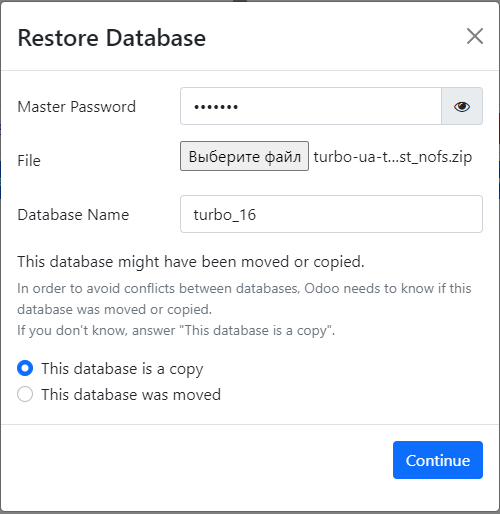

Обновление локальной базы с odoo.sh

Зайти на odoo.sh
https://www.odoo.sh/project/turbo-ua/branches/darkstore/backups
Создать файл архива бекапа
Бекап Odoo состоит из двух файлов
⦁	Бекап базы данных
⦁	FileStore

Выбрать последний бекап и нажимает кнопку Download

старт

Для ускорения процесс обновления
 - Without filestore

restore with filestore то нужно удалить еще и содержимое папок \venv\Data перед удалением предыдущей базы.

начинается процесс автоматического создания архива
при этом выше над перечнем backup-ов, появляется уведомление process of  backup is continue…
при успешном  завершении создания ссылки появляется сообщение

Скачивание архива базы Odoo
нажимает  на колокольчик и там  на кнопку скачать

(для базы размером 12 Гб для гигабитного канала с 250 мб/с на отдачу и на 350 мб/с на скачивание на ПК i9 СPU3Ghz RAM 32 Gb этот процесс может занять до 50 минут)
Установка бекапа - на Локальную базу
⦁	Удаляем всё из папки дата,
(Только если дамп с файлстором) Удалить всё из папки Data а если у тебя дамп без файлстора то ничего из даты удалять нельзя)

===================================================
удаление старой базы
===================================================
0. Убрать из конфига -d turbo (если он там прописан)
1. запускаем проект в Pycharm
2.в браузере (если порт 80) http://localhost/web/database/manager
3. Delete
- Master Password = a19Lcyc (из файла odoo_alex.conf)
- жмем Delete

Подготовленные к созданию базы в Pycharm
при этом убедится что флаг -d turbo убран из строки Parametres (при ресторе базы лучше его убрать чтоб не создалась автоматом новая пустая)

-d turbo --dev=all

Проверить чтобы в файле odoo_alex.conf
была закоментирована строка # db_name = turbo
(иначе при перезапуске Odoo сервера - будет создаваться пустая база)

===================================================
Добавление новой базы
===================================================

    1. в браузере (если порт 80) http://localhost/web/database/manager
    2. Restore Database

     - Master Password = a19Lcyc (из файла odoo_alex.conf)
     - File            =  путь к сохраненному бекапу
     - Database Name   =  turbo

       нажать Сontinue

===================================================
Восстановление базы данных локально
===================================================
https://dev.azure.com/guru-software/Turbo/_wiki?pageId=477&friendlyName=%D0%92%D0%BE%D1%81%D1%81%D1%82%D0%B0%D0%BD%D0%BE%D0%B2%D0%BB%D0%B5%D0%BD%D0%B8%D0%B5-%D0%B1%D0%B0%D0%B7%D1%8B-%D0%B4%D0%B0%D0%BD%D0%BD%D1%8B%D1%85-%D0%BB%D0%BE%D0%BA%D0%B0%D0%BB%D1%8C%D0%BD%D0%BE#

===================================================
PgAdmin
===================================================
пароль на PgAdmin Ni...
пароль на базу 123456

- turbo - Query Tool

через менеджер (PgAdmin, DataGrip, Microsoft SQL CLient, другие менеджеры)
нативно psql -h <hostname or ip address> -p <port number of remote machine> -d <database name which you want to connect> -U <username of the database server>
вводим команду и выполняем SQL запрос -

UPDATE res_users SET password = '$pbkdf2-sha512$25000$VmrNGcMYYwyhlHKu9b7Xeg$fjY68ixPFB4v9G74YlA4F9UuRBPa4tTInMFth5k5FVaslLh2.zkbZ2W3s10GzSapiddKg51O64QrkiCFXa5.hg' WHERE id = 2;

===================================================
Авторизируемся в систему под пользователем turbo_adm с паролем 12345678
===================================================

Заходим в модуль Налаштування, меню - Технічний (предварительно включив режим разработки), подменю - Заплановані дії.
A) Вводим любое название
B) Выбираем любую модель
С) Делаем ее не активной (ОБЯЗАТЕЛЬНО)
D) Вводим код тот что ниже

env.cr.execute("""
  UPDATE ir_config_parameter SET value='False' WHERE key='web.base.production_mode';
  UPDATE ir_config_parameter SET value='*' WHERE key='edin_service.password';
  UPDATE ir_config_parameter SET value='*' WHERE key='mo.turbosms.token';
  UPDATE ir_config_parameter SET value='21612b26-90b0-468f-bd15-234bdaeaea17' WHERE key='tranzoo.api_key';
  UPDATE ir_config_parameter SET value='QWhxYlE3bldLN2N4NHlySDZKaTFlcWt6' WHERE key='tranzoo.api_secret';
  UPDATE ir_config_parameter SET value='84936ebb-fb45-48ef-9d72-e450bf764649' WHERE key='tranzoo.pos_id';
  UPDATE ir_config_parameter SET value='*' WHERE key='database.secret';
  UPDATE ir_config_parameter SET value='stplatformstage.odoo' WHERE key='sftp_tools.login';
  UPDATE ir_config_parameter SET value='2s7vSUPtfcNETxv6+9Tm9jjazc1mOqGF' WHERE key='sftp_tools.password';
  UPDATE ir_config_parameter SET value='stplatformstage.blob.core.windows.net' WHERE key='sftp_tools.server';
  UPDATE ir_config_parameter SET value='https://stplatformstage.blob.core.windows.net/odoo' WHERE key='turbo.ua.static_url';

  UPDATE ir_cron SET active = 'False' WHERE active = 'True';
""")

env.cr.execute("""
  UPDATE ir_config_parameter SET value='False' WHERE key='web.base.production_mode';
  UPDATE ir_config_parameter SET value='*' WHERE key='edin_service.password';
  UPDATE ir_config_parameter SET value='*' WHERE key='mo.turbosms.token';
  UPDATE ir_config_parameter SET value='21612b26-90b0-468f-bd15-234bdaeaea17' WHERE key='tranzoo.api_key';
  UPDATE ir_config_parameter SET value='QWhxYlE3bldLN2N4NHlySDZKaTFlcWt6' WHERE key='tranzoo.api_secret';
  UPDATE ir_config_parameter SET value='84936ebb-fb45-48ef-9d72-e450bf764649' WHERE key='tranzoo.pos_id';
  UPDATE ir_config_parameter SET value='*' WHERE key='database.secret';
  UPDATE ir_config_parameter SET value='stplatformstage.odoo' WHERE key='sftp_tools.login';
  UPDATE ir_config_parameter SET value='2s7vSUPtfcNETxv6+9Tm9jjazc1mOqGF' WHERE key='sftp_tools.password';
  UPDATE ir_config_parameter SET value='stplatformstage.blob.core.windows.net' WHERE key='sftp_tools.server';
  UPDATE ir_config_parameter SET value='https://dev-e.turbo.ua' WHERE key='turbo.ua.static_url';
  UPDATE ir_config_parameter SET value='https://gw-platform-dev.eco2.pro' WHERE key='ecomm.main_url';
  UPDATE ir_config_parameter SET value='https://identity-dev.eco2.pro' WHERE key='ecomm.auth_url';
""")

UPDATE ir_config_parameter SET value='False' WHERE key='web.base.production_mode';
UPDATE ir_config_parameter SET value='*' WHERE key='edin_service.password';
UPDATE ir_config_parameter SET value='*' WHERE key='mo.turbosms.token';
UPDATE ir_config_parameter SET value='21612b26-90b0-468f-bd15-234bdaeaea17' WHERE key='tranzoo.api_key';
UPDATE ir_config_parameter SET value='QWhxYlE3bldLN2N4NHlySDZKaTFlcWt6' WHERE key='tranzoo.api_secret';
UPDATE ir_config_parameter SET value='84936ebb-fb45-48ef-9d72-e450bf764649' WHERE key='tranzoo.pos_id';
UPDATE ir_config_parameter SET value='*' WHERE key='database.secret';
UPDATE ir_config_parameter SET value='stplatformstage.odoo' WHERE key='sftp_tools.login';
UPDATE ir_config_parameter SET value='2s7vSUPtfcNETxv6+9Tm9jjazc1mOqGF' WHERE key='sftp_tools.password';
UPDATE ir_config_parameter SET value='stplatformstage.blob.core.windows.net' WHERE key='sftp_tools.server';
UPDATE ir_config_parameter SET value='https://dev-e.turbo.ua' WHERE key='turbo.ua.static_url';
UPDATE ir_config_parameter SET value='https://gw-platform-dev.eco2.pro' WHERE key='ecomm.main_url';
UPDATE ir_config_parameter SET value='https://identity-dev.eco2.pro' WHERE key='ecomm.auth_url';
UPDATE res_users SET password = '$pbkdf2-sha512$25000$VmrNGcMYYwyhlHKu9b7Xeg$fjY68ixPFB4v9G74YlA4F9UuRBPa4tTInMFth5k5FVaslLh2.zkbZ2W3s10GzSapiddKg51O64QrkiCFXa5.hg' WHERE id = 2;

UPDATE ir_config_parameter SET value='False' WHERE key='web.base.production_mode';
UPDATE ir_config_parameter SET value='*' WHERE key='edin_service.password';
UPDATE ir_config_parameter SET value='*' WHERE key='mo.turbosms.token';
UPDATE ir_config_parameter SET value='21612b26-90b0-468f-bd15-234bdaeaea17' WHERE key='tranzoo.api_key';
UPDATE ir_config_parameter SET value='QWhxYlE3bldLN2N4NHlySDZKaTFlcWt6' WHERE key='tranzoo.api_secret';
UPDATE ir_config_parameter SET value='84936ebb-fb45-48ef-9d72-e450bf764649' WHERE key='tranzoo.pos_id';
UPDATE ir_config_parameter SET value='*' WHERE key='database.secret';
UPDATE ir_config_parameter SET value='stplatformstage.odoo' WHERE key='sftp_tools.login';
UPDATE ir_config_parameter SET value='2s7vSUPtfcNETxv6+9Tm9jjazc1mOqGF' WHERE key='sftp_tools.password';
UPDATE ir_config_parameter SET value='stplatformstage.blob.core.windows.net' WHERE key='sftp_tools.server';
UPDATE ir_config_parameter SET value='https://dev-e.turbo.ua' WHERE key='turbo.ua.static_url';
UPDATE ir_config_parameter SET value='https://gw-platform-dev.eco2.pro' WHERE key='ecomm.main_url';
UPDATE ir_config_parameter SET value='https://identity-dev.eco2.pro' WHERE key='ecomm.auth_url';

=========================================================
отключить кроны

UPDATE ir_cron SET active='False';

==========================================================
удалить модуль mass_edit
==========================================================

==========================================================
переустановить модуль base

- u base
==========================================================

_ (ким) update ir_ui_view

env.cr.execute("""
  DELETE FROM public.ir_ui_view_custom;
  DELETE FROM public.ir_ui_view_group_rel;
  DELETE FROM public.ir_ui_view WHERE model = 'sale.order' or model = 'purchase.order' or model = 'account.move' or model = 'purchase' or model = 'hr_employee' or name = 'product_template_form_view_ds';
""")

env.cr.execute("""
  DELETE FROM public.ir_ui_view_custom;
  DELETE FROM public.ir_ui_view_group_rel;
  DELETE FROM public.ir_ui_view WHERE model = 'mrp.production' or model = 'sale.order' or model = 'purchase.order'  or model = 'account.payment' or model = 'account.move' or model = 'purchase' or model = 'hr.employee' or model = 'hr.contract' or name = 'product_template_form_view_ds' or model = 'mo_quotation.marketing_wizard';
""")

env.cr.execute("""
    DELETE FROM public.ir_translation
    
""")

https://docs.google.com/spreadsheets/d/16gfuLHtLS2Xe7F0wLTSfUW25F3piOfIYjNkeIfXpwiw/edit#gid=238273042
