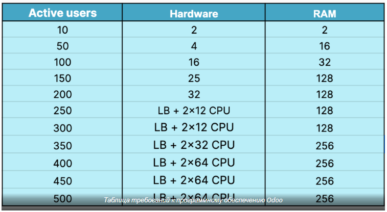

https://ventor.tech/odoo/odoo-hardware-requirements/

Для компаний с 5 сотрудниками будет достаточно сервера с 2 ЦП и 2 ОЗУ, а для 20 сотрудников — до 4 ЦП и 8 ОЗУ. Мы бы
рекомендовали разделить серверы приложений и баз данных на 90 сотрудников. Балансировка нагрузки (LB) сервера приложений
потребуется компании со штатом более 250 сотрудников.

Предположим, у вас есть система с 4 ядрами ЦП, 8 ГБ ОЗУ и 30 одновременными пользователями Odoo.

Чтобы определить необходимое количество рабочих, разделите количество пользователей на 6. В этом случае 30
пользователей, разделенные на 6, равны 5, что является теоретически необходимым количеством рабочих.

Чтобы рассчитать теоретическое максимальное количество рабочих, умножьте количество ядер ЦП на 2 и прибавьте 1. Для 4
ядер ЦП (4 * 2) + 1 равно 9, что является теоретическим максимальным количеством рабочих.

Основываясь на этих расчетах, вы можете использовать 5 рабочих для пользователей Odoo и еще одного рабочего для cron,
всего получается 6 рабочих.

Чтобы оценить потребление оперативной памяти, используйте следующую формулу:

Оперативная память = Количество рабочих * ((0,8 * 150) + (0,2 * 1024))

В данном случае 6 рабочих, умноженные на ((0,8*150) + (0,2*1024)) равняются примерно 2 ГБ ОЗУ.

Следовательно, исходя из этих расчетов, для установки Odoo потребуется около 2 ГБ ОЗУ.

Таблица требований к программному обеспечению Odoo
Изучите эту интерактивную диаграмму, чтобы найти подходящий набор оборудования для вашего Odoo (Community и Enterprise)
в зависимости от количества активных пользователей.

Копировать  
Обратите внимание: мы рекомендуем
– Разделение серверов приложений и баз данных, если у вас более 90 сотрудников.
– Балансировка нагрузки (LB) сервера приложений для компании со штатом более 250 сотрудников.

Также при установке Odoo учитывайте следующие требования:
Требования к программному обеспечению: обеспечьте совместимость с операционной системой, веб-сервером и поддерживаемыми
версиями программного обеспечения, указанными Odoo.

Требования к оборудованию: оцените возможности ЦП, ОЗУ, хранилища и сети, чтобы определить оптимальную конфигурацию
оборудования для эффективной работы системы.

Требования к установке Odoo: следуйте инструкциям по установке, рекомендованным Odoo , включая настройку базы данных,
настройку безопасности, процедуры резервного копирования и правильное администрирование системы.

Оборудование Odoo Inventory: для управления запасами интегрируйте совместимые сканеры штрих-кодов , принтеры этикеток и
другие устройства для повышения точности и оптимизации операций.