Скачать Одуу
===========================

Community
https://github.com/odoo/odoo
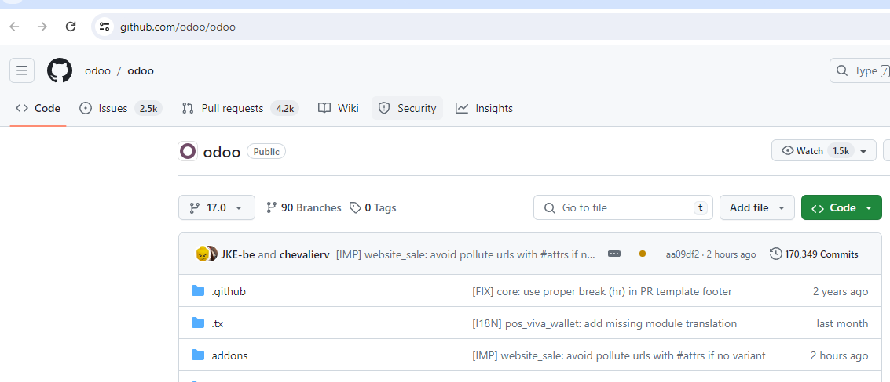

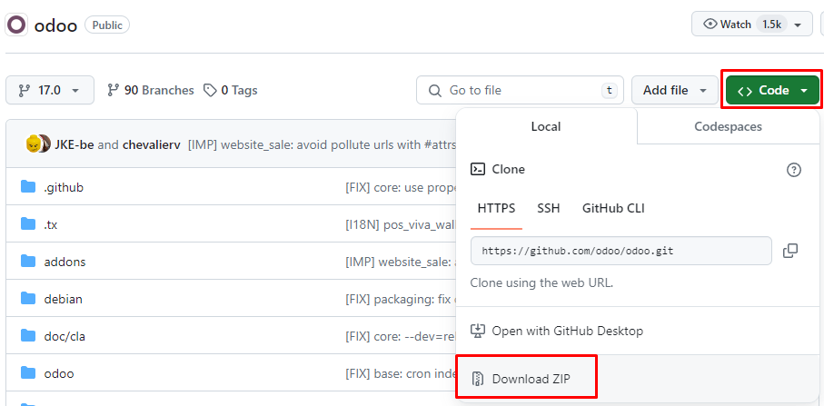

распаковать (например будет папка odoo-17.0)
===========================

Создать новую Папку на Диске Odoo_17
===========================
3. 
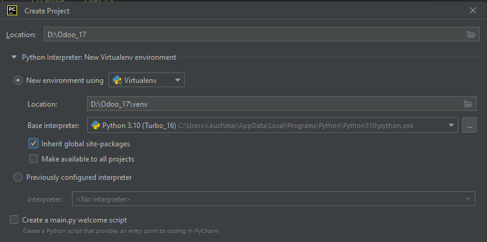
3. Pycharm - New Project - на папку Odoo_17
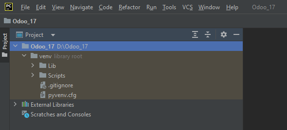
5. в проводнике в папке Odoo_17 - создать папку include, в нее (в проводнике) перенести исходники (например odoo-17.0) 

5. установить все из requarement
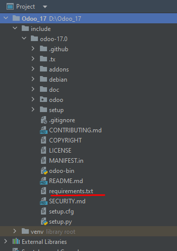
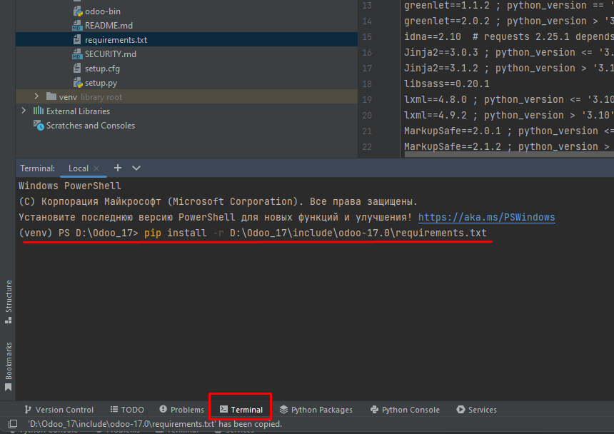
5. файлик odoo.conf
создать с нуля (или скопировать с 16)
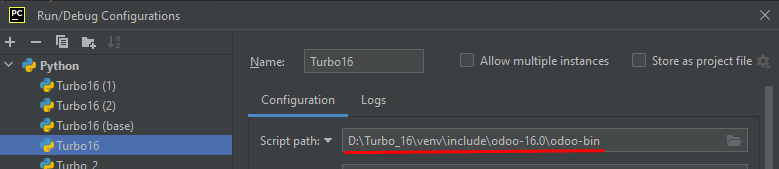
6. 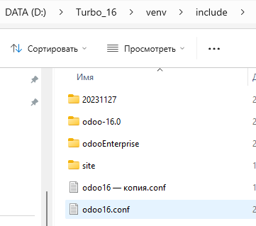
7. 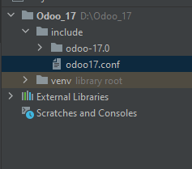
- отредактировать пути 
- 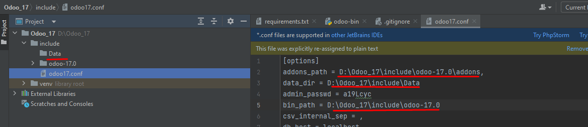
6. pycharm conf запуска
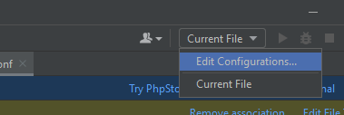
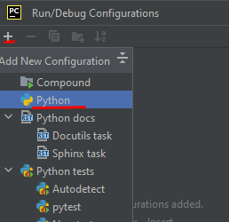
7. 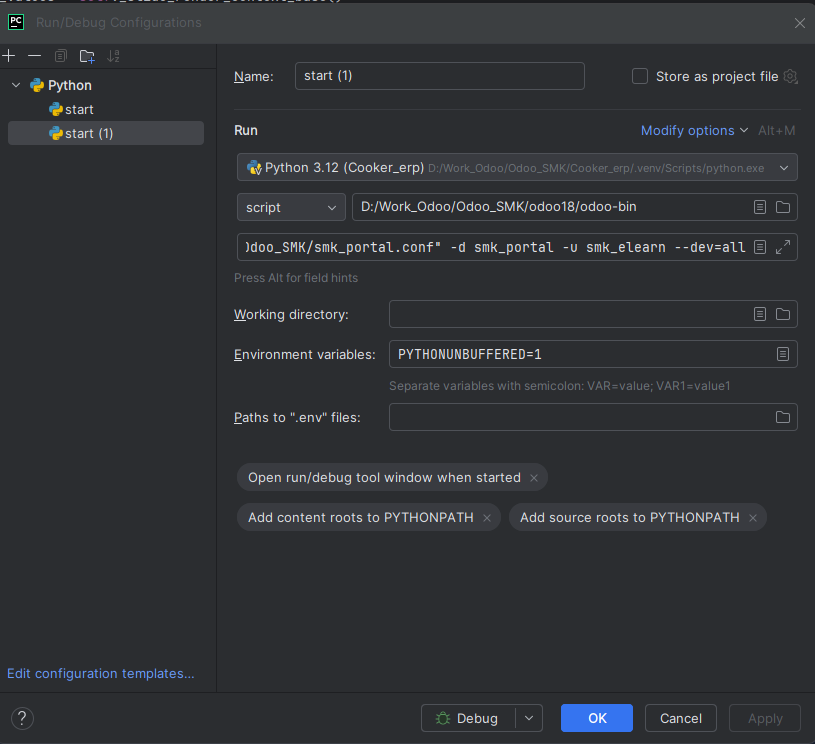

D:\Work_Odoo\Odoo_SMK\Odoo_18_c\odoo-bin
-c "D:/Work_Odoo/Odoo_SMK/smk_portal.conf" -d smk_portal -u smk_elearn --dev=all

8. запустить - база должна сама создастся
8. заходим в Одуу
8. admin admin

9. https://stage-erp.cooker.net.ua/web/database/manager
