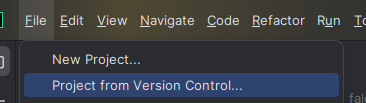
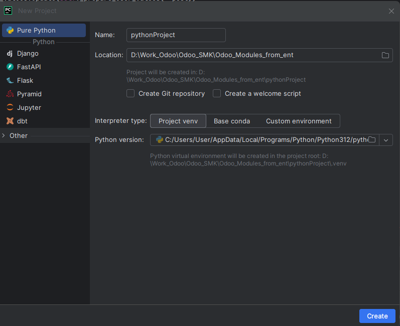
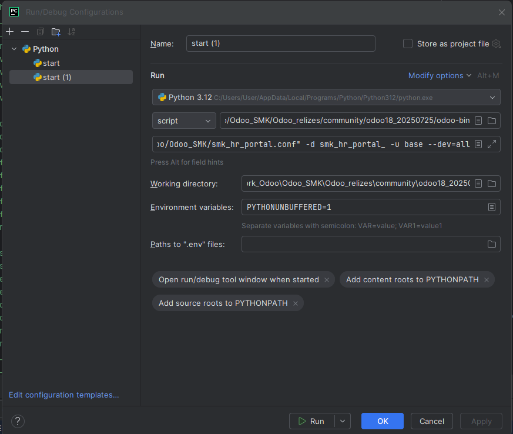
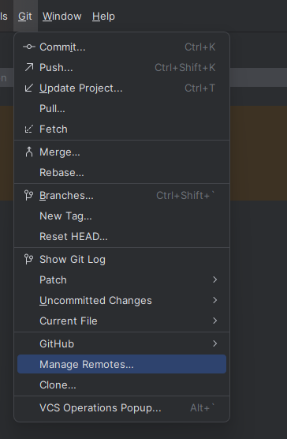
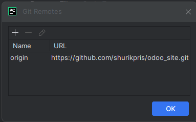

Создать пустую папку

Создать проект

скопировать файл конф
- в нем прописать пути к Комьюнити, Ентерпрайзу, к папке кастомных адонов 
addons_path = D:\Work_Odoo\Odoo_SMK\Odoo_18_c\odoo\addons, D:\Work_Odoo\Odoo_SMK\Odoo_18_e, D:\Work_Odoo\Odoo_SMK\Odoo_Modules_from_ent

D:\Work_Odoo\Odoo_SMK\Odoo_relizes\community\odoo18_20250725\odoo-bin
-c "D:\Work_Odoo\odoo_site\odoo_falcon.conf" -d smk_hr_portal_ -u base --dev=all
D:\Work_Odoo\Odoo_SMK\Odoo_relizes\community\odoo18_20250725

подключиться к Гиту если не через Вершин контрол
(cmd в експлоуере )
D:\Work_Odoo\odoo_site\odoo_falcon>git init 

