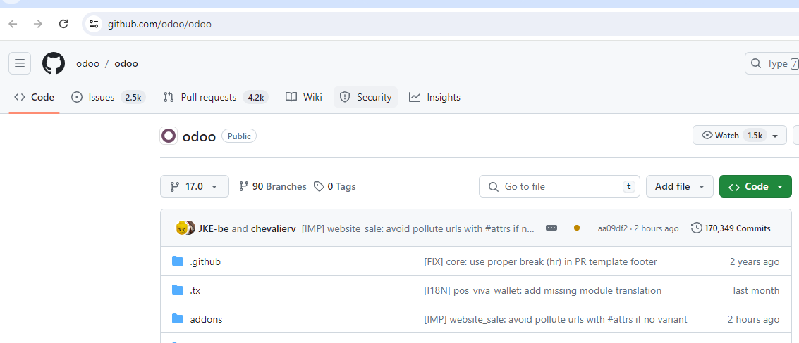

1. Скачать Одуу
Community
https://github.com/odoo/odoo

2. Папку на Диске Odoo_17
3. Pycharm - New Project - на папку Odoo_17
4. установить все из requarement
5. файлик odoo.conf
- отредактировать пути 
6. pycharm configuration
7. запустить - база должна сама создастся