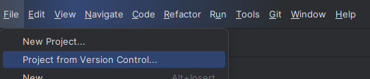
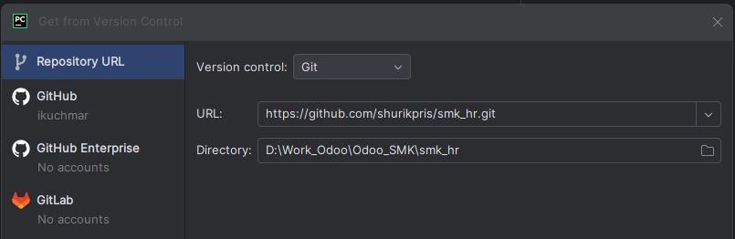

https://github.com/shurikpris/smk_hr

[img.png](img.png)
1. Создать папку на диске smk_hr
2. вставить файл с smk_hr.conf
3. в файле smk_hr.conf  - подправить адрес к папке smk_hr[img_1.png](img_1.png)
4. клонируем с гита 
3. 