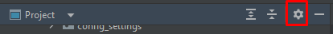
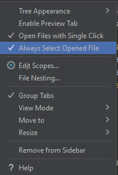

автоматическое отслеживание текущего файла в редакторе и автоматическое позиционирование на нем в дереве проекта в
PyCharm, выполните следующие шаги:

# Откройте дерево проекта:

Перейдите в панель "Проект" (Project), которая обычно находится слева в интерфейсе PyCharm.

# Включите автоматическое отслеживание:

В верхней части дерева проекта, рядом с названием проекта, найдите значок шестеренки (или три горизонтальные линии для
вызова меню настроек панели).

Нажмите на этот значок, чтобы открыть меню настроек.

# Выберите соответствующие опции:

В меню настроек выберите опцию "Always Select Opened File" (Всегда выбирать открытый файл) или "Autoscroll from
Source" (Автопрокрутка от источника).

