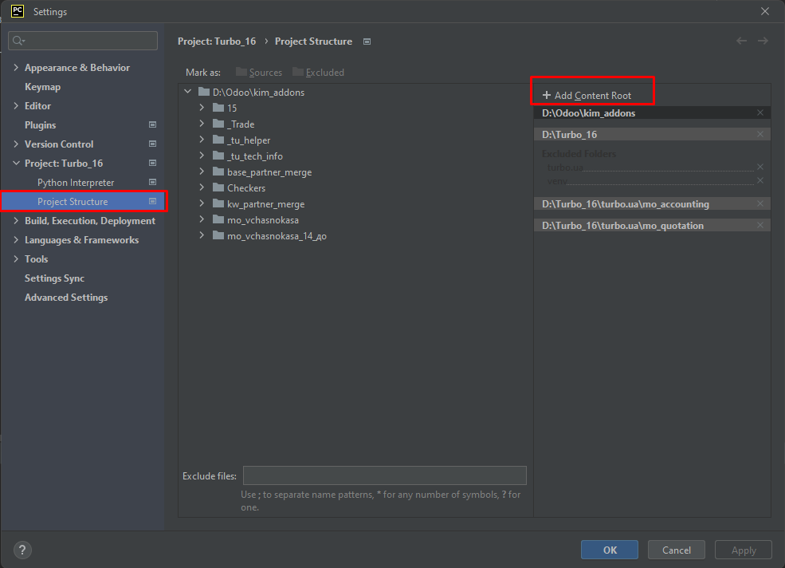

Чтобы присоединить папку к существующему проекту в PyCharm, выполните следующие шаги:

Откройте проект в PyCharm, в котором вы хотите присоединить новую папку.

На верхней панели выберите "Файл" (File) -> "Настройки проекта" (Settings) -> "Структура проекта" (Project Structure).

В окне "Структура проекта" вы увидите дерево файлов и папок вашего проекта.

Щелкните правой кнопкой мыши на папке в дереве файлов, к которой вы хотите добавить новую папку, и выберите "Добавить контент корня" (Add Content Root).

В появившемся диалоговом окне выберите новую папку, которую вы хотите присоединить к проекту, и нажмите "OK".

После этого новая папка будет добавлена в дерево файлов вашего проекта в PyCharm.