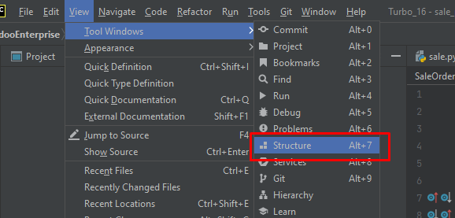
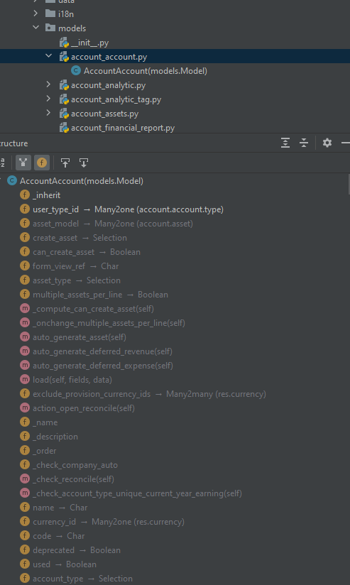

PyCharm позволяет отображать атрибуты класса в дереве файлов, используя функциональность, которая называется "Структура файла". Это позволяет видеть методы и атрибуты классов непосредственно в дереве файлов вместе с файлами. Вот как это сделать:

Откройте проект в PyCharm.

Перейдите в "Вид" (View) в главном меню.

Выберите "Структура файла" (Tool Windows -> Structure).

Или вы можете использовать горячие клавиши: Alt + 7 на клавиатуре (в Windows/Linux) или Command + 7 (в macOS).

В появившейся панели "Структура файла" вы увидите список классов и их атрибутов в дереве.

Если вы открываете файл с классами, вы увидите их атрибуты и методы сгруппированными.

Пожалуйста, имейте в виду, что "Структура файла" не только отображает атрибуты и методы классов, но также показывает и другие элементы файла, такие как функции и переменные. Эта функциональность может значительно упростить навигацию по вашим файлам и классам в проекте.

